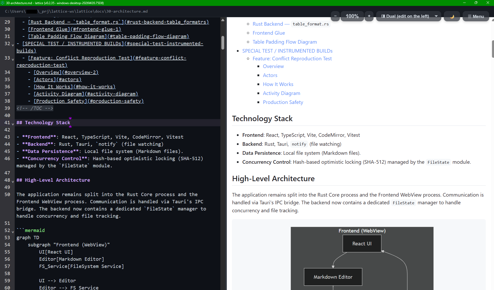
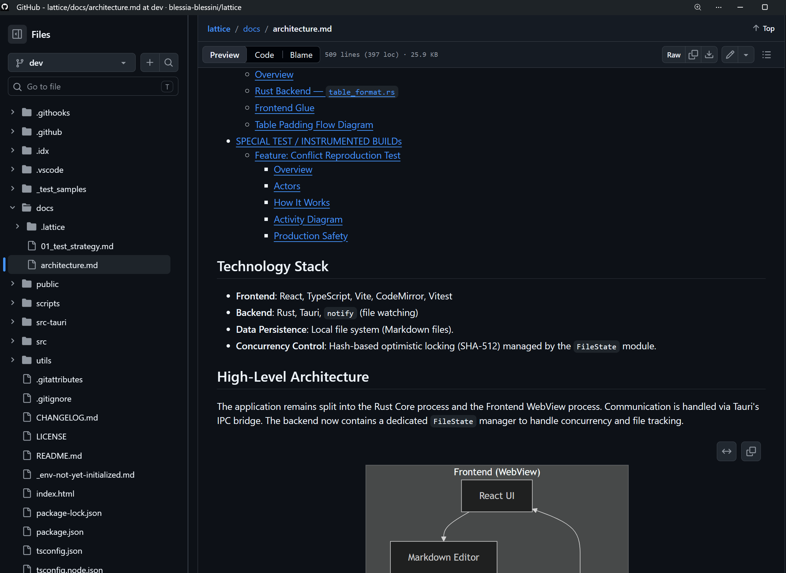

# _Lattice_ &emsp;&emsp;&emsp; [](https://github.com/blessia-blessini/lattice/actions/workflows/buildAndTest.yml) [](LICENSE) 

**Lattice** is an open-source, local-first Markdown environment editor, designed to bridge the gap between Personal Knowledge Management (PKM) and Corporate Systems Engineering.

## WHAT IS `Lattice` and WHY it exists

Being Markdown based, enables users of _Lattice_ to have:  
&ensp;&ensp;  ⇒ **DOCUMENTS AS CODE**  
  &ensp;&ensp;&ensp;&ensp;&ensp;&ensp;&ensp;&ensp;&ensp;&ensp;&ensp;&ensp;OR  
&ensp;&ensp;  ⇒ **Documents in plain-text**.

  Lattice strikes the right balance between _form_ and _content_. That is, one can still give **priority** of _content_ over _form_ when creating documents, while still keeping the expressiveness of the needed _form quality_ at very high aesthetic and comprehension level.   
  Lattice enables the _de-facto default interface markdown format_ between HUMANS and AI be directly managed as a _simple (set of) file(s)_ on a _local_ desktop computer or mobile phone. 
  
The plain-text format is efficiently versioned and `diff`ed by all code-versioning systems, which makes it ideal for mid- to strong- **change-controlled environment**(s) like engineering.  

The lack of native graphycal support is compensated by:
   - picture copy/paste with clear storage placement
   - mermaid for UML and other structured graphucs.

   
#### SHORT DESCRIPTION

 - Target Users are Data-Scientists, Developers and Tech-savvy people that want to make "documentation as code". The format suggested is Markdown as close as possible to GitGub.

   Markdown (*.md) files created with lattice look very much like (are rendered in preview mode like) the md files on GitHub. Here is a screenshot of how the lattice architecture document looks like (in lattice the preview/print theame is always `light` by design (and cannot be changed intentionally)):
    
, and here is how it looks on GitHub with a popular browser (with GitHub in `dark` theme mode):
    

 - **Easy to print-out** as pdf

#### IN TECHNICAL TERMS

 - **a recent set of CodeMirror features** - see https://codemirror.net/ 
 - **Split editor / preview** — CodeMirror 6 editor with live Markdown preview side-by-side
 - **Paste pictures** - paste directly pictures like screenshots in the document (stores the picture in a folder-name **derived from** the file name )
 - **Multi-window** — open multiple files in independent windows simultaneously
 - **Conflict detection** — hash-based optimistic locking prevents silent data loss when a file is modified externally
 - **Table of Contents** — auto-generate and refresh a linked heading list with `Ctrl/Cmd+Shift+T`
 - **Table formatting** — align pipe-table columns with `Ctrl/Cmd+Shift+L`
 - **`==highlight==` marks** — `==text==` syntax rendered with a highlighted background
 - **Daily notes** — configurable daily-note directory
 - **Mermaid diagrams** — fenced ` ```mermaid ``` ` blocks rendered inline
 - **Dark / light themes** — editor and preview themes are independent of each other and the OS
 - **Cross-platform** — Windows, macOS (universal), Linux, Android, iOS (the latter not delivered yet)

---

## DOCUMENTATION

- [Architecture](docs/30-architecture.md) — technology stack, data flow, CI pipeline, feature design
- [Test Strategy](docs/01-test-strategy.md) — test pipeline, coverage, linting
- [API Reference](docs/README.md) — generated frontend and backend API docs

---

## INSTALLATION

### FOR USERS

Download the latest stable release for your platform from our **[Releases Page](https://github.com/blessia-blessini/lattice/releases)**.

### FOR DEVELOPERS
Lattice is built with **Tauri v2**, **Rust**, and **React**.
#### GETTING STARTED / SETUP FOR DEVELOPMENT (EASIEST WAY TO)

1.  Clone the repository.
2.  Initialize the environment:
    *   **Windows**    : `.\scripts\setup_env.ps1`
    *   **macOS/Linux**: `./scripts/setup_env.sh`
      
#### PREREQUISITES (WHAT WILL BE INSTALLED BY THE SCRIPT ABOVE)
*   **Rust**: [Install Rust](https://www.rust-lang.org/tools/install)
*   **Node.js & npm**: [Install Node.js](https://nodejs.org/)

> Note: installation can be done with, and is documented in `.\scripts\setup_env.ps1` and `.\scripts\setup_env.sh` for Windows and Linux/MacOS respectively.

#### ENVIRONMENT CONFIGURATION (CRITICAL)

The build system requires the `LATTICEBUILD_NO` environment variable to be set. Without this, even `rust-analyzer` (which often runs automatically depending on installed extensions in VSCode) might report errors or builds may fail (though debug builds default to a safe fallback).

**For VS Code Users:**
We recommend adding this to your `.vscode/settings.json` or `.code-workspace` file:

```json
{
    "rust-analyzer.cargo.extraEnv": {
        "LATTICEBUILD_NO": "DevBuild"
    }
}
```

**For Command Line:**
*   **PowerShell**: `$env:LATTICEBUILD_NO="DevBuild"; npm run tauri dev # (| build )`
*   **Bash**: `export LATTICEBUILD_NO="DevBuild"; npm run tauri dev # (| build )`

#### COMMANDLINE FOR DEVELOPERS

We provide cross-platform scripts to help you build andrun the app, and to automatically handle environment variables (like `LATTICEBUILD_NO`) and standardize the build pipeline. You are encouraged to look into the scripts before you run them

| Description                                                               | macOS / Linux (Bash)         | Windows (PowerShell)          |
| :------------------------------------------------------------------------ | :--------------------------- | :---------------------------- |
| **1. Setup environment** (Install Rust, Node, NPM deps, init Android)     | `./scripts/setup_env.sh`     | `.\scripts\setup_env.ps1`     |
| **2. Start the app** in _development mode_ with hot-reload                | `./scripts/build-dev.sh`     | `.\scripts\build-dev.ps1`     |
| **3. Run the complete test suite** (Backend, Frontend, Coverage, Linting) | `./scripts/build-test.sh`    | `.\scripts\build-test.ps1`    |
| **4. Build a production release** for the respective OS                   | `./scripts/build-release.sh` | `.\scripts\build-release.ps1` |

#### DEVELOPMENT COMMANDS ALTERNATIVE

| Command               | Description                                           |
| :-------------------- | :---------------------------------------------------- |
| `npm run tauri dev`   | Start the app in development mode with hot-reloading. |
| `npm run tauri build` | Build a production release for your OS.               |

## LICENSING

This software is dual-licensed:

1. **Personal & Open Source Use**: Licensed under the [GNU AGPLv3](LICENSE). 
   This ensures the software remains transparent and that improvements 
   by the community are shared back.
   
2. **Commercial Use**: For entities that wish to use this software 
   without the "share-alike" requirements of the AGPL, a commercial 
   license is required. Please contact `blessia AT blessini.com` for details.


### COMMERCIAL USAGE POLICY

To encourage individual productivity, Blessia-Blessini grants you the following additional permissions under **Section 7** of the [GNU AGPLv3](LICENSE):

  - **Individual Employee Use**: Any individual employee of a corporation is permitted to use the software for their personal work tasks and editing without a paid commercial license.

  - **Threshold for Commercial Licensing**: A formal Commercial License is only required when the software is:

    - Integrated (embedded) into the company's automated workflows or production pipelines.
    - Distributed as part of a commercial product or service.
    - Deployed for use by more than *25 employees* within the same organization
   
⇒ If your usage meets these "embedded" or "team-wide" criteria, please contact  `blessia AT blessini.com` for a Commercial License.

See the [LICENSE](LICENSE) file for the full AGPLv3 text.
