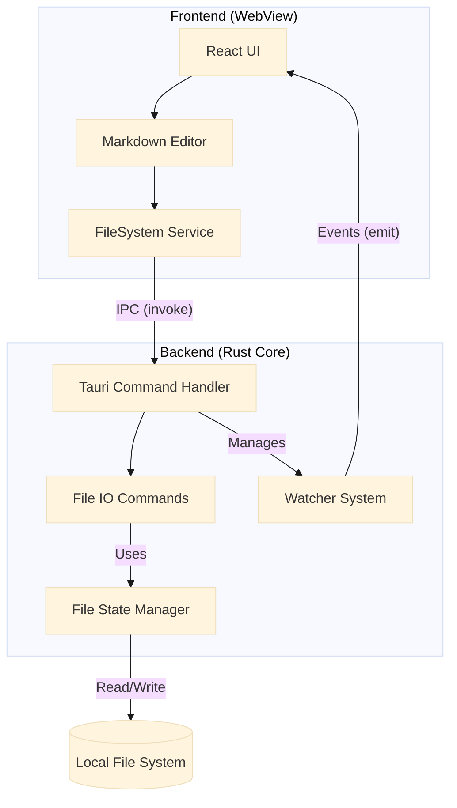
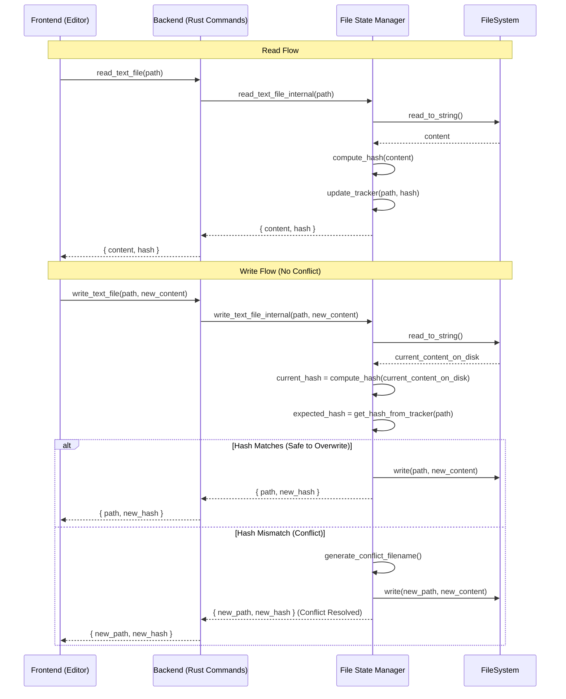
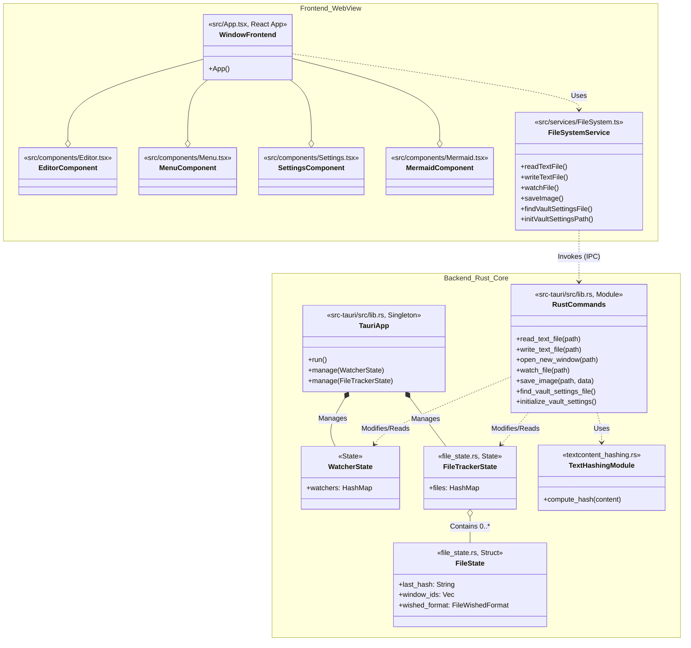
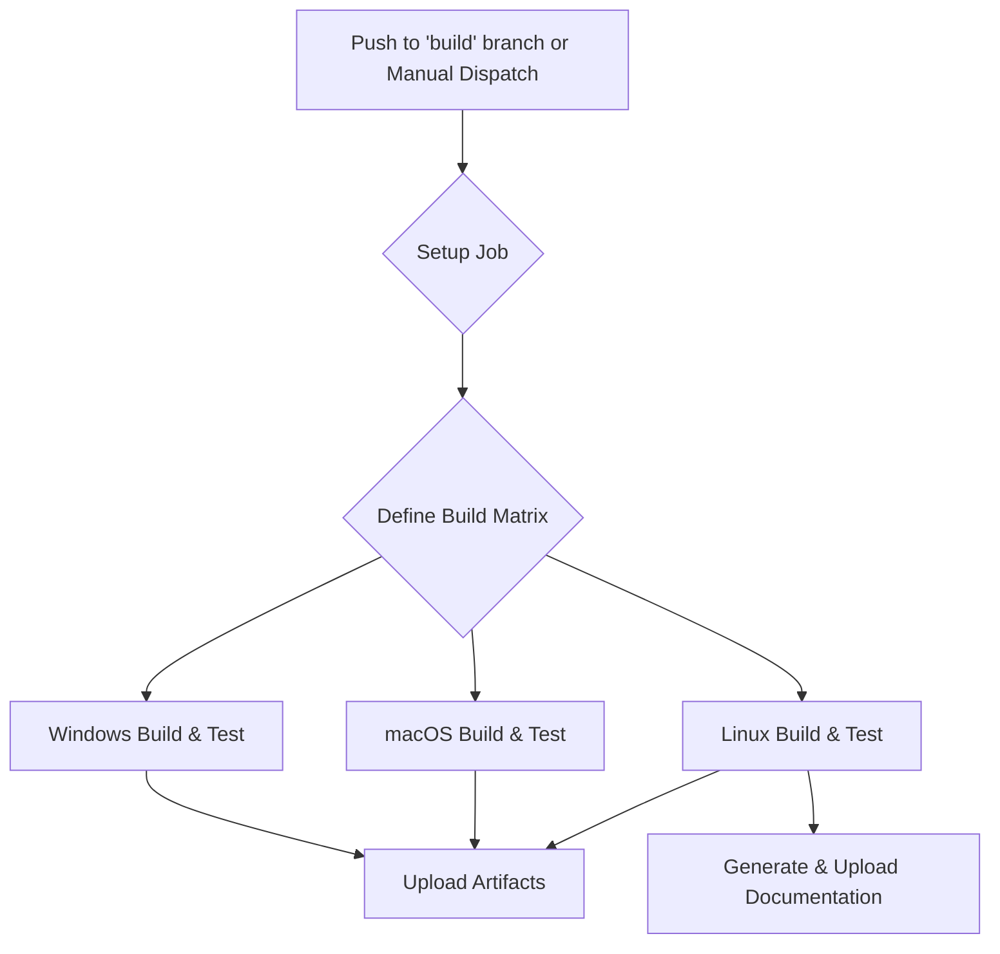
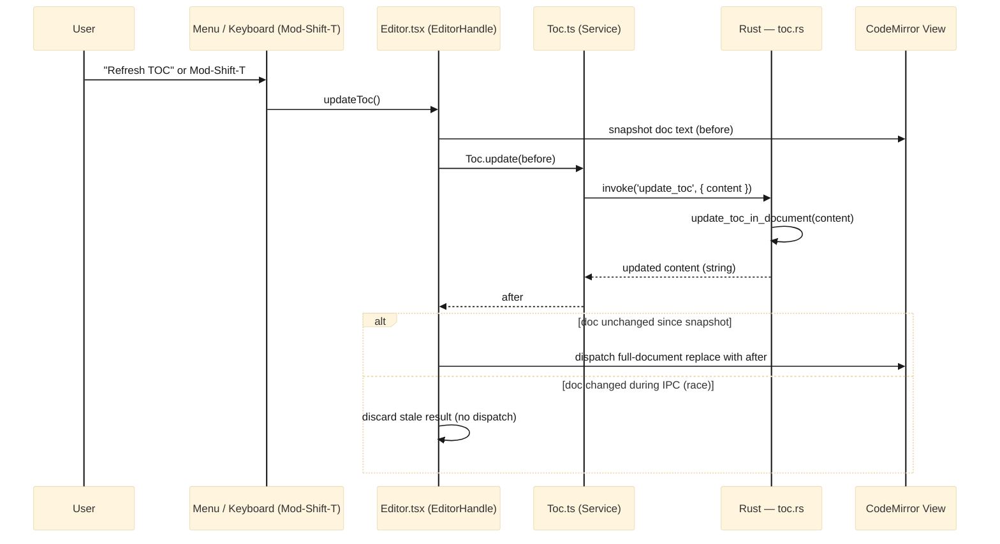
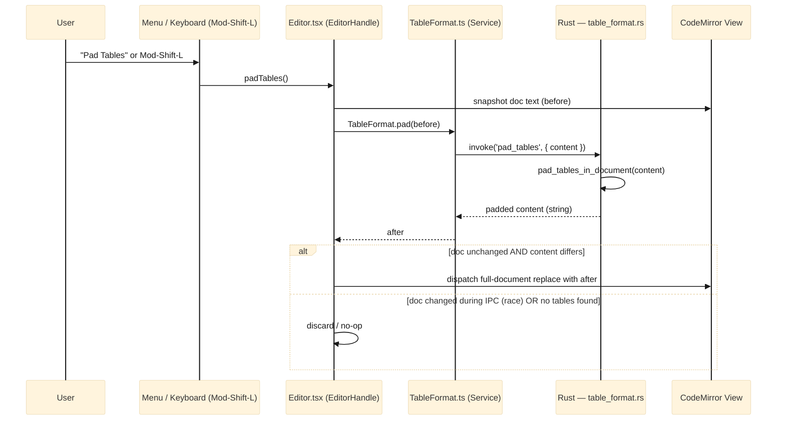
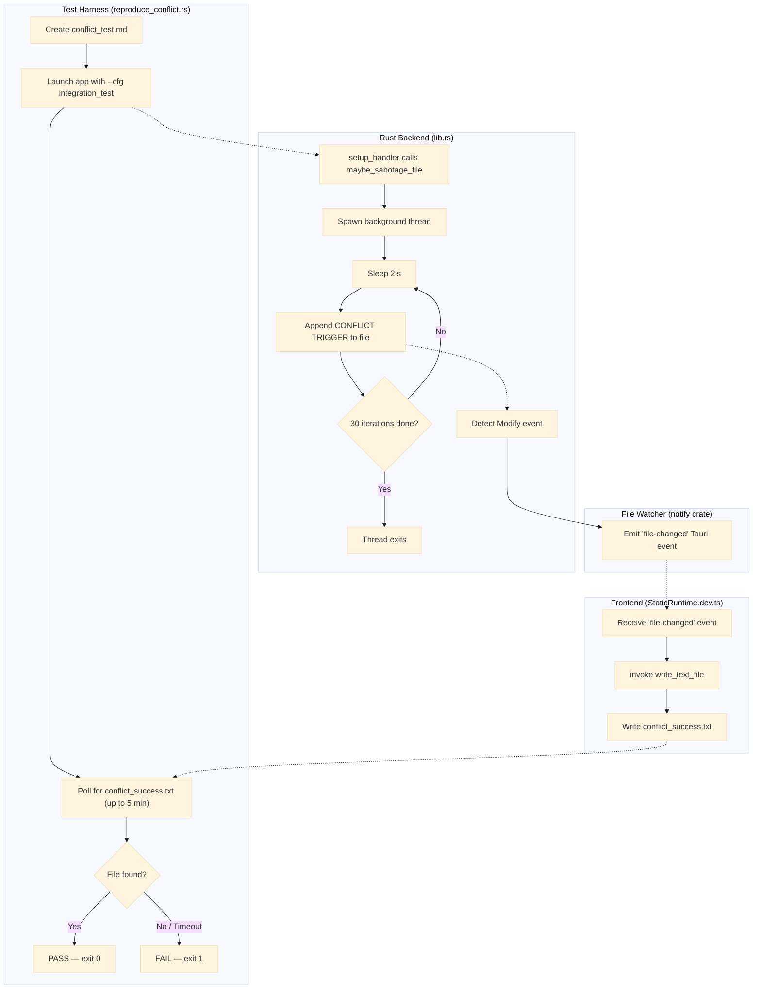

# Lattice Architecture (v2)

Lattice is a local-first Markdown editor built with **Tauri**, combining a **Rust** backend for system interactions and performance with a **React (TypeScript)** frontend for the user interface. This document reflects the current architecture, including the introduction of a more robust file tracking system, new UI components, and a formal testing and CI pipeline.

## Table of Content (Structure of document)
<!-- TOC -->
- [Table of Content (Structure of document)](#table-of-content-structure-of-document)
- [Technology Stack](#technology-stack)
- [High-Level Architecture](#high-level-architecture)
- [Key Components & Diagrams](#key-components-diagrams)
  - [1. File Operation & Concurrency](#1-file-operation-concurrency)
  - [2. Class and Instance Diagram (UML)](#2-class-and-instance-diagram-uml)
- [Theme Design](#theme-design)
  - [Editor Theme](#editor-theme)
  - [Preview Theme](#preview-theme)
  - [Independence Guarantee](#independence-guarantee)
  - [Adding a New Theme Variant](#adding-a-new-theme-variant)
- [Testing Architecture](#testing-architecture)
- [Continuous Integration (CI) Architecture](#continuous-integration-ci-architecture)
  - [CI Pipeline Flow](#ci-pipeline-flow)
  - [Key CI Steps:](#key-ci-steps)
- [Feature: Table of Contents (TOC)](#feature-table-of-contents-toc)
  - [Overview](#overview)
  - [Rust Backend — `toc.rs`](#rust-backend-tocrs)
  - [Frontend Glue](#frontend-glue)
  - [TOC Flow Diagram](#toc-flow-diagram)
- [Feature: Table Padding](#feature-table-padding)
  - [Overview](#overview-1)
  - [Rust Backend — `table_format.rs`](#rust-backend-table_formatrs)
  - [Frontend Glue](#frontend-glue-1)
  - [Table Padding Flow Diagram](#table-padding-flow-diagram)
- [SPECIAL TEST / INSTRUMENTED BUILDs](#special-test-instrumented-builds)
  - [Feature: Conflict Reproduction Test](#feature-conflict-reproduction-test)
    - [Overview](#overview-2)
    - [Actors](#actors)
    - [How It Works](#how-it-works)
    - [Activity Diagram](#activity-diagram)
    - [Production Safety](#production-safety)
- [Architectural Decisions](#architectural-decisions)
  - [ADR-01: External Image Fetches Blocked by Default](#adr-01-external-image-fetches-blocked-by-default)
<!-- /TOC -->

## Technology Stack

- **Frontend**: React, TypeScript, Vite, CodeMirror, Vitest
- **Backend**: Rust, Tauri, `notify` (file watching)
- **Data Persistence**: Local file system (Markdown files).
- **Concurrency Control**: Hash-based optimistic locking (SHA-512) managed by the `FileState` module.

## High-Level Architecture

The application remains split into the Rust Core process and the Frontend WebView process. Communication is handled via Tauri's IPC bridge. The backend now contains a dedicated `FileState` manager to handle concurrency and file tracking.



## Key Components & Diagrams

### 1. File Operation & Concurrency

The concurrency model remains optimistic-locking but is now encapsulated within the `file_state.rs` module on the backend. The `FileTrackerState` holds a map of all known files, their last-seen hashes, and which windows are viewing them.



### 2. Class and Instance Diagram (UML)

This diagram is updated to include new UI components (`Menu`, `Settings`, `Mermaid`) and the new backend modules (`FileTrackerState`, `FileState`, `TextHashingModule`).



## Theme Design

Lattice uses an **orthogonal, two-theme model**: the editor (app) theme and the preview pane theme are fully independent of each other and of the OS color scheme.

### Editor Theme

Controlled by the `m_theme` state (`'dark' | 'light'`) in `App.tsx`, loaded from vault settings on startup and toggled via the toolbar. It is applied by setting `data-theme` on the root `.container` div, which cascades to all editor UI elements (toolbar, CodeMirror, dividers, etc.) via CSS attribute selectors.

### Preview Theme

Controlled by a separate `m_previewTheme` state (`'dark' | 'light'`) in `App.tsx`, defaulting to `'light'`. It is applied via:

- `data-preview-theme` on the `.preview-pane` div — drives background/text colors.
- `data-theme` on the inner `.markdown-body` div — drives `github-markdown-css` rendering.
- An explicit `color-scheme` CSS declaration on each `[data-preview-theme]` variant — this prevents the OS or root `color-scheme: light dark` from overriding the pane's rendering.

### Independence Guarantee

The two themes do not influence each other. A dark editor with a light preview, or any other combination, is valid. This is enforced at the CSS level: `.preview-pane[data-preview-theme]` rules carry their own `color-scheme` declaration, isolating the pane from both the ancestor `data-theme` cascade and the OS preference.

```
OS color scheme
      │  (blocked by color-scheme declaration on .preview-pane)
      ▼
.container [data-theme]          ← Editor / App theme
      │
      ├── toolbar, dividers, CodeMirror ...
      │
      └── .preview-pane [data-preview-theme]   ← Preview theme (independent)
                │
                └── .markdown-body [data-theme=previewTheme]
```

### Adding a New Theme Variant

To add a new preview theme (e.g. `'sepia'`):
1. Extend the `ViewMode`-style union type for `m_previewTheme` in `App.tsx`.
2. Add a `.preview-pane[data-preview-theme="sepia"] { color-scheme: light; ... }` block in `App.css`.
3. Add the matching `.markdown-body[data-theme="sepia"]` overrides in `App.css`.

No changes to `App.tsx` rendering logic are needed beyond wiring `setPreviewTheme` to a UI control.

## Testing Architecture

> Full details of the test strategy, pipeline commands, and rationale are in
> **[01-test-strategy.md](01-test-strategy.md)**.

The pipeline (`scripts/build-test.sh` / `build-test.ps1`) covers three Rust
phases (unit, integration, E2E conflict reproducer) plus frontend Vitest
coverage, a Clippy linter pass, and a combined `llvm-cov` HTML report.
The E2E phase runs the full compiled application under coverage instrumentation
to validate the file-conflict detection flow end-to-end.

## Continuous Integration (CI) Architecture

The CI pipeline is defined in `.github/workflows/buildAndTest.yml` and is triggered on pushes to specific branches or manually. It uses a matrix strategy to ensure the application builds and passes tests across all major desktop platforms.

### CI Pipeline Flow



### Key CI Steps:
1.  **Setup Job**: A preliminary job determines which platforms (e.g., `windows-desktop`, `linux-desktop`, `all`) to run on based on the manual trigger input or the branch name. It generates a JSON matrix for the next job.
2.  **Build & Test Job**: This job runs in parallel for each configuration in the matrix.
    -   **Environment**: Sets up Node.js, Rust (including cross-compilation targets if needed), and caches dependencies.
    -   **Build**: Compiles the Rust backend and builds the frontend, finally bundling them into a native application (`.exe`, `.dmg`, `.AppImage`).
    -   **Test**: Executes `scripts/build-test.sh` (Linux/macOS) or `build-test.ps1` (Windows), which runs the full multi-phase test pipeline — see [01-test-strategy.md](01-test-strategy.md) for the complete pipeline description.
    -   **Artifacts**: The final compiled applications and documentation are uploaded as artifacts for download and deployment.

---

## Feature: Table of Contents (TOC)

### Overview

The TOC feature lets a user insert a `<!-- TOC -->` / `<!-- /TOC -->` marker pair anywhere in the document and have Lattice auto-generate (and later regenerate) a linked heading list inside it. The feature follows the same architectural pattern as all pure-logic features: **all parsing and rewriting logic lives in Rust**; the frontend is a thin glue layer that hands text to the backend and dispatches the result back into CodeMirror.

### Rust Backend — `toc.rs`

The module exposes one public entry-point:

```
update_toc_in_document(content: &str) -> String
```

It performs a single-pass scan of the document and replaces the body of every `<!-- TOC … -->` / `<!-- /TOC -->` block with a freshly generated bulleted list of headings. Key properties:

- **Marker parsing**: The opening marker accepts optional `minLevel=N` and `maxLevel=N` key-value options (defaults: H2–H6). Unknown options are silently ignored for forward compatibility.
- **Heading collection**: Headings are gathered only from text that lies outside fenced code blocks (` ``` ` / `~~~`). Headings that themselves sit inside the TOC body are skipped, so the generated list never references its own entries.
- **Slug generation**: Each heading is converted to a GitHub-style anchor slug (lowercase, non-alphanumerics stripped, spaces to hyphens). Duplicate headings are disambiguated with `-1`, `-2`, … suffixes.
- **Idempotency**: Running the command on an already up-to-date document produces a string-equal result — the caller can rely on this to avoid spurious CodeMirror dispatches.
- **Newline preservation**: CRLF line endings in the original document are preserved in the output.

The Tauri command `update_toc` is a thin wrapper that calls `update_toc_in_document` and returns the result string.

### Frontend Glue

| Layer                | File                                   | Responsibility                                                                                                                                                                                                                                                                                                                                                          |
| -------------------- | -------------------------------------- | ----------------------------------------------------------------------------------------------------------------------------------------------------------------------------------------------------------------------------------------------------------------------------------------------------------------------------------------------------------------------- |
| Service              | `src/services/Toc.ts`                  | Wraps `invoke('update_toc', { content })`. Also exports `TOC_OPEN_MARKER` / `TOC_CLOSE_MARKER` constants so other layers don't duplicate the literal strings.                                                                                                                                                                                                           |
| CodeMirror extension | `src/editor-extensions/toc-tooltip.ts` | A `StateField` + `showTooltip` that re-evaluates on every cursor move. If the cursor's line is between a TOC open marker and its matching close marker, a tooltip reading *"Press Ctrl/Cmd+Shift+T to refresh TOC"* is shown. Detection is intentionally done on the frontend (not via IPC) to keep the tooltip latency imperceptible.                                  |
| Editor handle        | `src/components/Editor.tsx`            | Exposes `updateToc()` and `insertTocBlock()` on the imperative `EditorHandle`. Both call `refreshTocFromBackend()`, which snapshots the document, calls `Toc.update`, then guards the dispatch: if the document changed during the IPC round-trip, the stale result is discarded instead of clobbering the user's edits. `Mod-Shift-T` is bound to the refresh command. |
| Menu                 | `src/App.tsx`                          | "Insert TOC" triggers `insertTocBlock()` (inserts the marker pair then immediately refreshes). "Refresh TOC" triggers `updateToc()`.                                                                                                                                                                                                                                    |

### TOC Flow Diagram



---

## Feature: Table Padding

### Overview

The Table Padding feature reformats any GFM pipe table in the document so that every column is space-padded to the width of its widest cell, making tables easier to read in raw Markdown. Like TOC, all detection and rewriting logic is **pure Rust**; the frontend layer is a minimal IPC wrapper.

### Rust Backend — `table_format.rs`

The module exposes one public entry-point:

```
pad_tables_in_document(content: &str) -> String
```

It performs a linear scan looking for table candidates and rewrites each one in place. Key properties:

- **Table detection**: A table candidate is a run of consecutive non-blank lines where (1) the first line contains at least one `|`, (2) the second line is a GFM alignment-separator row (each cell matches `:?-+:?`), and (3) all subsequent lines in the run also contain at least one `|`. Lines inside fenced code blocks are unconditionally skipped.
- **Column alignment**: The `Alignment` enum captures four states — `Default` (no marker), `Left` (`:---`), `Right` (`---:`), and `Center` (`:---:`). Cell content is padded on the appropriate side; the separator row is regenerated with the correct number of `-` characters (minimum 3) and `:` markers.
- **Row normalisation**: Rows with fewer cells than the widest row are right-extended with empty cells. Rows with extra cells keep their extra cells.
- **Output shape**: Every rewritten row uses the canonical `| cell | cell |` form — leading and trailing pipes are always present, cells are surrounded by a single space.
- **Width measurement**: Column width is measured in Unicode scalar value count (`char`), not bytes — a practical approximation for typical Markdown content without pulling in a `unicode-width` dependency.
- **Idempotency**: Tables that are already in canonical padded form are emitted unchanged; the caller can detect a no-op by comparing the returned string to the input.

The Tauri command `pad_tables` is a thin wrapper that calls `pad_tables_in_document` and returns the result string.

### Frontend Glue

| Layer         | File                                      | Responsibility                                                                                                                                                                                                                                                               |
| ------------- | ----------------------------------------- | ---------------------------------------------------------------------------------------------------------------------------------------------------------------------------------------------------------------------------------------------------------------------------- |
| Service       | `src/services/TableFormat.ts`             | Wraps `invoke('pad_tables', { content })`. Mirrors the shape of `Toc.ts` so both document-rewriting operations are interchangeable at call sites.                                                                                                                            |
| Editor handle | `src/components/Editor.tsx`               | Exposes `padTables()` on `EditorHandle`. Internally `padTablesFromBackend()` uses the same snapshot → IPC → guarded-dispatch pattern as the TOC refresh: if the document changed during the round-trip the stale result is discarded. `Mod-Shift-L` is bound to the command. |
| Menu          | `src/components/Menu.tsx` + `src/App.tsx` | A "Pad Tables" menu item calls `padTables()` on the editor handle.                                                                                                                                                                                                           |

### Table Padding Flow Diagram


---

## SPECIAL TEST / INSTRUMENTED BUILDs

### Feature: Conflict Reproduction Test

#### Overview

Lattice includes an end-to-end integration test that validates the **file-conflict detection pipeline** — i.e., it proves the app correctly detects and reacts when a file it has open is modified externally (by another process, a sync tool, etc.). The test is driven by a compile-time feature flag (`--cfg integration_test`) that activates an "internal bad actor" in the Rust backend while the full application is running.

#### Actors

The test involves three cooperating actors:

| Actor                  | Source File                                                                  | Role                                                                                                     |
| ---------------------- | ---------------------------------------------------------------------------- | -------------------------------------------------------------------------------------------------------- |
| **Test Harness**       | `src-tauri/examples/reproduce_conflict.rs`                                   | Orchestrator — creates a test file, launches the app with the feature flag, polls for a success marker   |
| **Internal Bad Actor** | `src-tauri/src/lib.rs` → `test_utils::maybe_sabotage_file`                   | Simulates an external process modifying the file behind the app's back (30 writes, one every 2 s)        |
| **Success Reporter**   | `src/services/StaticRuntime/StaticRuntime.dev.ts` → `setupTestModeListeners` | Frontend listener — detects the `file-changed` event and writes `conflict_success.txt` to signal success |

#### How It Works

1. **`reproduce_conflict.rs`** creates `conflict_test.md` with initial content, then launches `npm run tauri dev` with `RUSTFLAGS="--cfg integration_test"`. This compile-time flag enables the sabotage code path.
2. During app startup, **`setup_handler`** in `lib.rs` calls `test_utils::maybe_sabotage_file(&fpath)`. With the `integration_test` cfg active, the real implementation runs: a background thread waits 2 seconds, then **mutates the file on disk every 2 seconds for 1 minute** (30 iterations), appending `[TEST MODE CONFLICT TRIGGER]` each time.
3. The app's **`watch_file`** command (using the `notify` crate) is watching that file. When the sabotage thread writes to it, `notify` fires a `Modify` event → the Rust backend emits a `"file-changed"` Tauri event to the frontend.
4. On the frontend, **`setupTestModeListeners`** (DEV-only) is listening for `"file-changed"`. When it fires, it writes `conflict_success.txt` via the `write_text_file` Tauri command.
5. Back in `reproduce_conflict.rs`, the harness is **polling** for `conflict_success.txt` (up to 5 minutes to allow for a cold build). Once detected → **PASS**. Timeout → **FAIL**.

#### Activity Diagram



#### Production Safety

The sabotage code is **completely compiled out** in production builds:

- **Backend**: `#[cfg(not(integration_test))]` provides a no-op `maybe_sabotage_file` stub.
- **Frontend**: The production `StaticRuntime` has `setupTestModeListeners` as a no-op.
- The `integration_test` cfg is only activated when `RUSTFLAGS="--cfg integration_test"` is explicitly passed, which only happens inside the `reproduce_conflict` example or via `Test-Conflict.ps1` / `build-test.sh`.

---

## Feature: Preview Link Routing

<!--ARCH-LTTCE-LNK-00001-->
### Overview

Every link click in the preview pane is intercepted by a custom `a` renderer inside `previewComponents`
(defined in `src/App.tsx`). The renderer classifies the href and applies one of four routing strategies,
ensuring the Tauri WebView never navigates away from the application.

| href pattern | Strategy | Outcome |
| --- | --- | --- |
| `http://…` | Blocked — rendered as `<span>` | Struck-through, dimmed, tooltip, no action |
| `https://…`, `mailto:…` | External | Opens in system browser via `openUrl` |
| `#id` | In-page anchor | Scrolls preview to matching heading element |
| `./file.md`, `../x.txt` | Local document | Opens resolved path in a new Lattice window |
| `./file.pdf`, `./img.png` | Local non-document | Silently ignored |

<!--ARCH-LTTCE-LNK-00002-->
### Path Resolution

The pure helper `resolveRelativePath(href, currentFilePath)` in `src/lib/link-utils.ts` handles
relative path resolution:

- Strips any `#fragment` suffix before resolving.
- Detects the platform path separator (`\` vs `/`) from `currentFilePath`.
- Normalises forward-slash hrefs (the Markdown convention) to the platform separator.
- Walks the combined `dir + sep + href` string segment-by-segment, handling `..` and `.` correctly.
- Returns `null` for pure fragment hrefs or when `currentFilePath` is empty.

The companion predicate `isDocumentLink(filePart)` checks whether the extension is `.md`, `.markdown`,
or `.txt` (case-insensitive). Both functions are pure and independently unit-tested.

### Integration Point

`previewComponents` is a `useMemo`-stabilised object in `App.tsx`, keyed on `m_currentFilePath` (among
other deps). The `a` renderer closes over `m_currentFilePath` so path resolution always uses the path of
the currently open file. `resolveRelativePath` and `isDocumentLink` are imported from `src/lib/link-utils.ts`.

---

## Feature: GFM[^gfm] Linter

<!--ARCH-LTTCE-LNT-00001-->
### Overview

The GFM Linter is a live, in-editor diagnostic system that surfaces GitHub Flavored Markdown ambiguities and errors directly in the CodeMirror 6 editing surface. It follows the same design principle as all frontend-only features in Lattice: pure logic stays in TypeScript, no new runtime dependencies are introduced, and the feature is wired into the existing extension system.

**Key design decisions:**

- `@codemirror/lint` was already a transitive dependency (via `lintKeymap`). The linter activates it fully with zero new packages.
- The linter runs as a CM6 `ViewPlugin` via the `linter()` factory, debounced automatically by the framework after each document change.
- All 12 rules are contained in a single file (`src/editor-extensions/gfm-linter.ts`) to keep the extension self-contained and independently testable.

<!--ARCH-LTTCE-LNT-00002-->
### Severity Visualisation

Three severity levels map to distinct wavy underline colours via CSS `background-image` overrides on the CM6 lint mark classes:

| Severity  | Colour             | CSS class                         | Meaning                                                |
| --------- | ------------------ | --------------------------------- | ------------------------------------------------------ |
| `hint`    | Green (`#3fb950`)  | `cm-gfm-lint`                     | Low-risk ambiguity; renders differently across parsers |
| `warning` | Orange (`#f0883e`) | `cm-gfm-lint cm-gfm-lint-warning` | Commonly stripped or mishandled by renderers           |
| `error`   | Red (CM6 default)  | —                                 | Will render broken in all GFM-compliant renderers      |

The SVG wavy underlines are inline `data:` URIs in `App.css` — no server requests, no external resources.

<!--ARCH-LTTCE-LNT-00003-->
### Tree-Walk Rules

The following rules are implemented by traversing the Lezer syntax tree produced by `@codemirror/lang-markdown`. Each fires on a specific Lezer node type:

| Lezer node                           | Rule                              | Severity | REQ               |
| ------------------------------------ | --------------------------------- | -------- | ----------------- |
| `SetextHeading1`, `SetextHeading2`   | Setext heading ambiguity          | hint     | REQ-LTTCE-LNT-0000A |
| `CodeBlock`                          | Indented code block               | hint     | REQ-LTTCE-LNT-0000B |
| `HTMLBlock`                          | Raw HTML block                    | warning  | REQ-LTTCE-LNT-0000C |
| `HTMLTag`                            | Inline HTML tag                   | hint     | REQ-LTTCE-LNT-0000D |
| `Table` → `TableHeader` / `TableRow` | Column count mismatch             | error    | REQ-LTTCE-LNT-0000E |
| `BulletList`, `OrderedList`          | Loose list (blank line in list)   | hint     | REQ-LTTCE-LNT-00011 |
| `FencedCode` (no `CodeInfo` child)   | Missing language tag              | warning  | REQ-LTTCE-LNT-00012 |
| `Image` (empty ``)             | Empty alt text                    | warning  | REQ-LTTCE-LNT-00013 |
| `ATXHeading*`[^atx], `SetextHeading*` | Duplicate heading (two-pass)     | warning  | REQ-LTTCE-LNT-00014 |

<!--ARCH-LTTCE-LNT-00004-->
### Text-Scan Rules

Three rules operate on the raw document string rather than the Lezer tree, because the patterns they detect appear as plain text and produce no dedicated syntax node. To avoid false positives, positions inside `Link`, `Image`, `Autolink`, `InlineCode`, `FencedCode`, and `CodeBlock` nodes are collected as exclusion ranges before scanning.

| Pattern                              | Rule                       | Severity | REQ                 |
| ------------------------------------ | -------------------------- | -------- | ------------------- |
| `https?://…` in plain prose          | Bare URL                   | hint     | REQ-LTTCE-LNT-0000F |
| `~text~` (single tilde, not `~~`)    | Single-tilde strikethrough | hint     | REQ-LTTCE-LNT-00010 |
| Opening fence with no matching close | Unclosed fenced code block | error    | REQ-LTTCE-LNT-00015 |

### Integration Point

`gfmLinter` is registered as a CM6 extension in `src/components/Editor.tsx` `getExtensions()`. The existing `lintKeymap` (already present) provides keyboard access (`Mod-Shift-m`) to the lint panel without any additional wiring.

---

## Architectural Decisions

### ADR-01: External Image Fetches Blocked by Default

**Context.** The preview pane renders Markdown via `ReactMarkdown`, which converts
`` into an ``. When `url` is `http://` or `https://`,
the WebView fetches the image automatically — leaking the user's IP address,
User-Agent, and the fact that they are viewing a specific document to the
third-party host. For a local-first editor that targets engineering and PKM
workflows, this is a non-trivial privacy and supply-chain concern (a compromised
image host could also be used as a side-channel beacon).

**Decision.** Block external image fetches by default. The setting
`blockExternalImages` (persisted in `settings.json`, defaults to `true`) controls
the behaviour. When enabled, any `` whose `src` starts with `http://` or
`https://` is replaced in the preview by a visible *"🚫 External image blocked"*
placeholder containing a click-through `<a href>` link to the same URL — the
user can choose to follow the link in a real browser without the editor itself
making the request.

**Alternatives considered.**
- *Tauri CSP `img-src` restriction* — enforced at WebView level, zero custom code.
  Rejected because CSP is static at build time and cannot be toggled per user
  preference. Reserved as a potential future hardening layer (defence in depth).
- *Proxy all external images through the Rust backend* — would allow caching and
  stripping of tracking parameters. Rejected for v1 as added complexity without
  clearly better privacy than simply refusing to fetch.

**Trade-offs.** README files and other documents that legitimately depend on
external badges/screenshots will render with placeholders by default; the user
must explicitly opt in to allow external fetches. This is the intended
privacy-by-default posture.

**Scope.** Applies only to the preview pane. The editor (CodeMirror) renders
the markdown source as text and never fetches images. Local relative-path
images continue to work normally — they are loaded via the
`read_file_base64` Tauri command, not via HTTP.

**Files involved.**
- `src-tauri/src/settings.rs` — `block_external_images` field, default `true`
- `src/components/Settings.tsx` — toggle UI
- `src/App.tsx` — `img` renderer in `previewComponents` enforces the gate

---

[^gfm]: GFM — GitHub Flavored Markdown. The Markdown dialect specified by GitHub, extending CommonMark
    with tables, task lists, strikethrough, and autolinks. <https://github.github.com/gfm/>

[^cm6]: CM6 — CodeMirror 6. The sixth major version of the CodeMirror browser-based code-editor library.
    <https://codemirror.net>

[^atx]: ATX heading style — headings prefixed with `#` characters (e.g. `## Heading`). Named after
    Aaron Swartz's *atx* plain-text formatting tool (2002).

[^svg]: SVG — Scalable Vector Graphics. An XML-based vector image format supported natively by browsers. It is a very common file extension.
