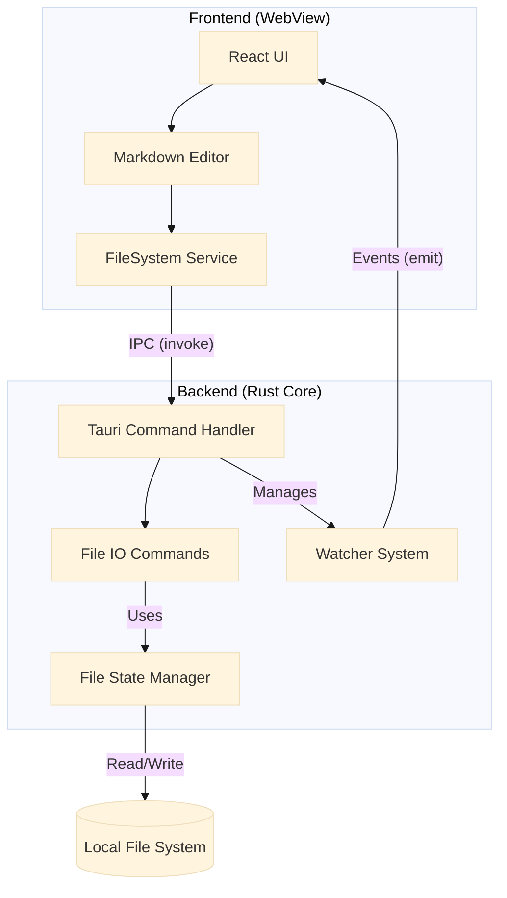
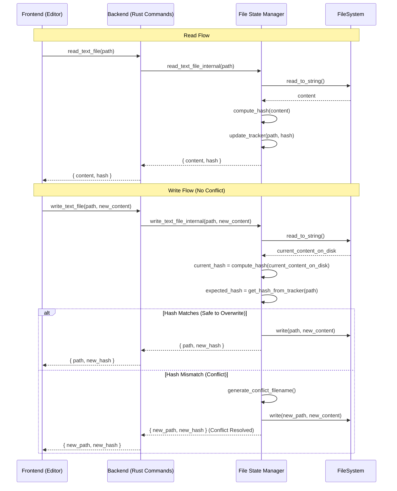
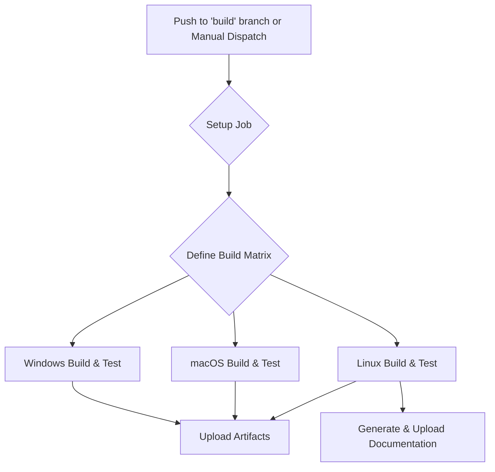
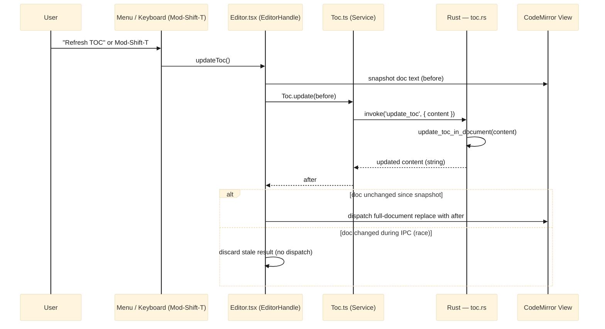
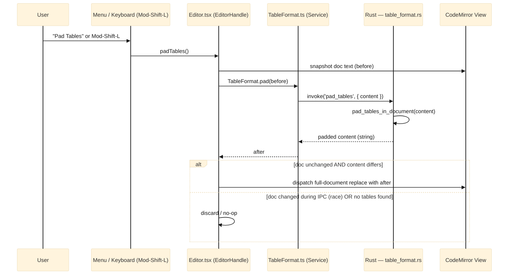
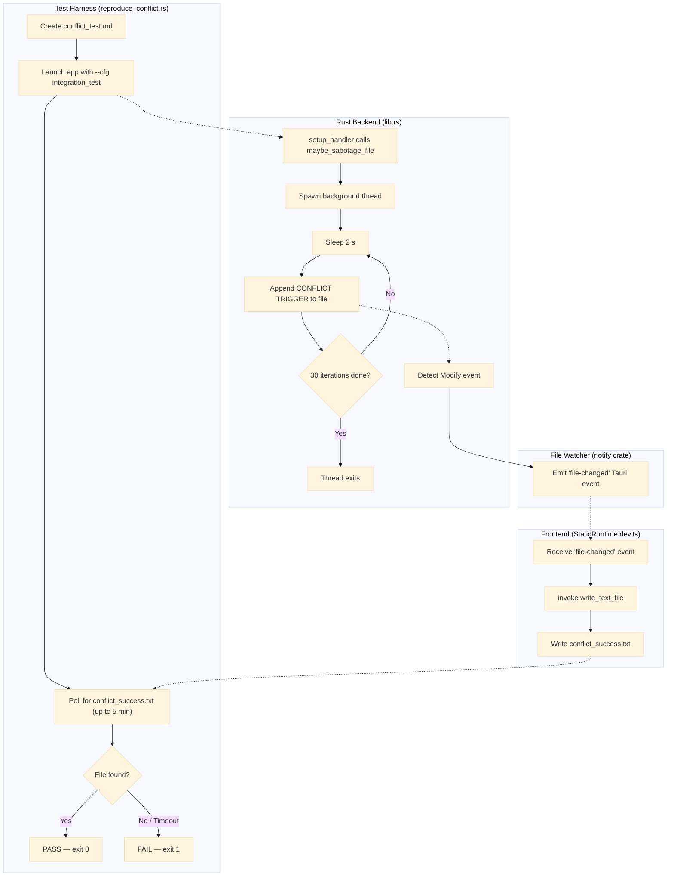
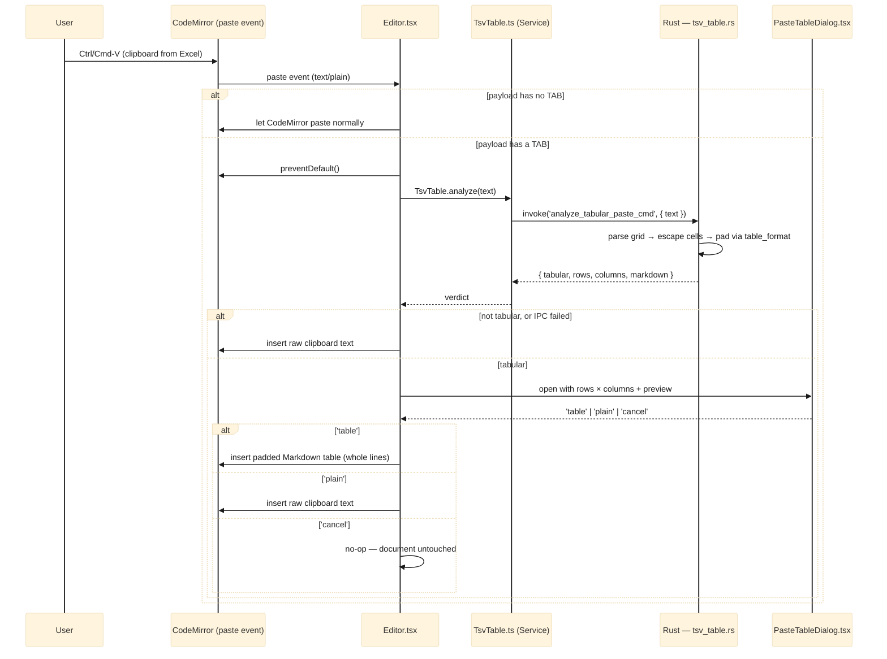

# Lattice Architecture (v2)

Lattice is a local-first Markdown editor built with **Tauri**, combining a **Rust** backend for system interactions and performance with a **React (TypeScript)** frontend for the user interface. This document reflects the current architecture, including the introduction of a more robust file tracking system, new UI components, and a formal testing and CI pipeline.

## Table of Content (Structure of document)
<!-- TOC -->
- [Table of Content (Structure of document)](#table-of-content-structure-of-document)
- [Technology Stack](#technology-stack)
- [High-Level Architecture](#high-level-architecture)
- [Key Components & Diagrams](#key-components-diagrams)
  - [1. File Operation & Concurrency](#1-file-operation-concurrency)
  - [2. Class and Instance Diagram (UML)](#2-class-and-instance-diagram-uml)
- [Theme Design](#theme-design)
  - [Editor Theme](#editor-theme)
  - [Preview Theme](#preview-theme)
  - [Independence Guarantee](#independence-guarantee)
  - [Adding a New Theme Variant](#adding-a-new-theme-variant)
- [Testing Architecture](#testing-architecture)
- [Continuous Integration (CI) Architecture](#continuous-integration-ci-architecture)
  - [CI Pipeline Flow](#ci-pipeline-flow)
  - [Key CI Steps:](#key-ci-steps)
- [Feature: Table of Contents (TOC)](#feature-table-of-contents-toc)
  - [Overview](#overview)
  - [Rust Backend — `toc.rs`](#rust-backend-tocrs)
  - [Frontend Glue](#frontend-glue)
  - [TOC Flow Diagram](#toc-flow-diagram)
- [Feature: Table Padding](#feature-table-padding)
  - [Overview](#overview-1)
  - [Rust Backend — `table_format.rs`](#rust-backend-table_formatrs)
  - [Frontend Glue](#frontend-glue-1)
  - [Table Padding Flow Diagram](#table-padding-flow-diagram)
- [SPECIAL TEST / INSTRUMENTED BUILDs](#special-test-instrumented-builds)
  - [Feature: Conflict Reproduction Test](#feature-conflict-reproduction-test)
    - [Overview](#overview-2)
    - [Actors](#actors)
    - [How It Works](#how-it-works)
    - [Activity Diagram](#activity-diagram)
    - [Production Safety](#production-safety)
- [Architectural Decisions](#architectural-decisions)
  - [ADR-01: External Image Fetches Blocked by Default](#adr-01-external-image-fetches-blocked-by-default)
<!-- /TOC -->

## Technology Stack

- **Frontend**: React, TypeScript, Vite, CodeMirror, Vitest
- **Backend**: Rust, Tauri, `notify` (file watching)
- **Data Persistence**: Local file system (Markdown files).
- **Concurrency Control**: Hash-based optimistic locking (SHA-512) managed by the `FileState` module.

## High-Level Architecture

The application remains split into the Rust Core process and the Frontend WebView process. Communication is handled via Tauri's IPC bridge. The backend now contains a dedicated `FileState` manager to handle concurrency and file tracking.



## Key Components & Diagrams

### 1. File Operation & Concurrency

The concurrency model remains optimistic-locking but is now encapsulated within the `file_state.rs` module on the backend. The `FileTrackerState` holds a map of all known files, their last-seen hashes, and which windows are viewing them.



### 2. Class and Instance Diagram (UML)

This diagram is updated to include new UI components (`Menu`, `Settings`, `Mermaid`) and the new backend modules (`FileTrackerState`, `FileState`, `TextHashingModule`).


## Theme Design

Lattice uses an **orthogonal, two-theme model**: the editor (app) theme and the preview pane theme are fully independent of each other and of the OS color scheme.

### Editor Theme

Controlled by the `m_theme` state (`'dark' | 'light'`) in `App.tsx`, loaded from vault settings on startup and toggled via the toolbar. It is applied by setting `data-theme` on the root `.container` div, which cascades to all editor UI elements (toolbar, CodeMirror, dividers, etc.) via CSS attribute selectors.

### Preview Theme

Controlled by a separate `m_previewTheme` state (`'dark' | 'light'`) in `App.tsx`, defaulting to `'light'`. It is applied via:

- `data-preview-theme` on the `.preview-pane` div — drives background/text colors.
- `data-theme` on the inner `.markdown-body` div — drives `github-markdown-css` rendering.
- An explicit `color-scheme` CSS declaration on each `[data-preview-theme]` variant — this prevents the OS or root `color-scheme: light dark` from overriding the pane's rendering.

### Independence Guarantee

The two themes do not influence each other. A dark editor with a light preview, or any other combination, is valid. This is enforced at the CSS level: `.preview-pane[data-preview-theme]` rules carry their own `color-scheme` declaration, isolating the pane from both the ancestor `data-theme` cascade and the OS preference.

```
OS color scheme
      │  (blocked by color-scheme declaration on .preview-pane)
      ▼
.container [data-theme]          ← Editor / App theme
      │
      ├── toolbar, dividers, CodeMirror ...
      │
      └── .preview-pane [data-preview-theme]   ← Preview theme (independent)
                │
                └── .markdown-body [data-theme=previewTheme]
```

### Adding a New Theme Variant

To add a new preview theme (e.g. `'sepia'`):
1. Extend the `ViewMode`-style union type for `m_previewTheme` in `App.tsx`.
2. Add a `.preview-pane[data-preview-theme="sepia"] { color-scheme: light; ... }` block in `App.css`.
3. Add the matching `.markdown-body[data-theme="sepia"]` overrides in `App.css`.

No changes to `App.tsx` rendering logic are needed beyond wiring `setPreviewTheme` to a UI control.

## Testing Architecture

> Full details of the test strategy, pipeline commands, and rationale are in
> **[01-test-strategy.md](01-test-strategy.md)**.

The pipeline (`scripts/build-test.sh` / `build-test.ps1`) covers three Rust
phases (unit, integration, E2E conflict reproducer) plus frontend Vitest
coverage, a Clippy linter pass, and a combined `llvm-cov` HTML report.
The E2E phase runs the full compiled application under coverage instrumentation
to validate the file-conflict detection flow end-to-end.

## Continuous Integration (CI) Architecture

The CI pipeline is defined in `.github/workflows/buildAndTest.yml` and is triggered on pushes to specific branches or manually. It uses a matrix strategy to ensure the application builds and passes tests across all major desktop platforms.

### CI Pipeline Flow



### Key CI Steps:
1.  **Setup Job**: A preliminary job determines which platforms (e.g., `windows-desktop`, `linux-desktop`, `all`) to run on based on the manual trigger input or the branch name. It generates a JSON matrix for the next job.
2.  **Build & Test Job**: This job runs in parallel for each configuration in the matrix.
    -   **Environment**: Sets up Node.js, Rust (including cross-compilation targets if needed), and caches dependencies.
    -   **Build**: Compiles the Rust backend and builds the frontend, finally bundling them into a native application (`.exe`, `.dmg`, `.AppImage`).
    -   **Test**: Executes `scripts/build-test.sh` (Linux/macOS) or `build-test.ps1` (Windows), which runs the full multi-phase test pipeline — see [01-test-strategy.md](01-test-strategy.md) for the complete pipeline description.
    -   **Artifacts**: The final compiled applications and documentation are uploaded as artifacts for download and deployment.

---

## Feature: Table of Contents (TOC)

### Overview

The TOC feature lets a user insert a `<!-- TOC -->` / `<!-- /TOC -->` marker pair anywhere in the document and have Lattice auto-generate (and later regenerate) a linked heading list inside it. The feature follows the same architectural pattern as all pure-logic features: **all parsing and rewriting logic lives in Rust**; the frontend is a thin glue layer that hands text to the backend and dispatches the result back into CodeMirror.

### Rust Backend — `toc.rs`

The module exposes one public entry-point:

```
update_toc_in_document(content: &str) -> String
```

It performs a single-pass scan of the document and replaces the body of every `<!-- TOC … -->` / `<!-- /TOC -->` block with a freshly generated bulleted list of headings. Key properties:

- **Marker parsing**: The opening marker accepts optional `minLevel=N` and `maxLevel=N` key-value options (defaults: H2–H6). Unknown options are silently ignored for forward compatibility.
- **Heading collection**: Headings are gathered only from text that lies outside fenced code blocks (` ``` ` / `~~~`). Headings that themselves sit inside the TOC body are skipped, so the generated list never references its own entries.
- **Slug generation**: Each heading is converted to a GitHub-style anchor slug (lowercase, non-alphanumerics stripped, spaces to hyphens). Duplicate headings are disambiguated with `-1`, `-2`, … suffixes.
- **Idempotency**: Running the command on an already up-to-date document produces a string-equal result — the caller can rely on this to avoid spurious CodeMirror dispatches.
- **Newline preservation**: CRLF line endings in the original document are preserved in the output.

The Tauri command `update_toc` is a thin wrapper that calls `update_toc_in_document` and returns the result string.

### Frontend Glue

| Layer                | File                                   | Responsibility                                                                                                                                                                                                                                                                                                                                                          |
| -------------------- | -------------------------------------- | ----------------------------------------------------------------------------------------------------------------------------------------------------------------------------------------------------------------------------------------------------------------------------------------------------------------------------------------------------------------------- |
| Service              | `src/services/Toc.ts`                  | Wraps `invoke('update_toc', { content })`. Also exports `TOC_OPEN_MARKER` / `TOC_CLOSE_MARKER` constants so other layers don't duplicate the literal strings.                                                                                                                                                                                                           |
| CodeMirror extension | `src/editor-extensions/toc-tooltip.ts` | A `StateField` + `showTooltip` that re-evaluates on every cursor move. If the cursor's line is between a TOC open marker and its matching close marker, a tooltip reading *"Press Ctrl/Cmd+Shift+T to refresh TOC"* is shown. Detection is intentionally done on the frontend (not via IPC) to keep the tooltip latency imperceptible.                                  |
| Editor handle        | `src/components/Editor.tsx`            | Exposes `updateToc()` and `insertTocBlock()` on the imperative `EditorHandle`. Both call `refreshTocFromBackend()`, which snapshots the document, calls `Toc.update`, then guards the dispatch: if the document changed during the IPC round-trip, the stale result is discarded instead of clobbering the user's edits. `Mod-Shift-T` is bound to the refresh command. |
| Menu                 | `src/App.tsx`                          | "Insert TOC" triggers `insertTocBlock()` (inserts the marker pair then immediately refreshes). "Refresh TOC" triggers `updateToc()`.                                                                                                                                                                                                                                    |

### TOC Flow Diagram



---

## Feature: Table Padding

### Overview

The Table Padding feature reformats any GFM pipe table in the document so that every column is space-padded to the width of its widest cell, making tables easier to read in raw Markdown. Like TOC, all detection and rewriting logic is **pure Rust**; the frontend layer is a minimal IPC wrapper.

### Rust Backend — `table_format.rs`

The module exposes one public entry-point:

```
pad_tables_in_document(content: &str) -> String
```

It performs a linear scan looking for table candidates and rewrites each one in place. Key properties:

- **Table detection**: A table candidate is a run of consecutive non-blank lines where (1) the first line contains at least one `|`, (2) the second line is a GFM alignment-separator row (each cell matches `:?-+:?`), and (3) all subsequent lines in the run also contain at least one `|`. Lines inside fenced code blocks are unconditionally skipped.
- **Column alignment**: The `Alignment` enum captures four states — `Default` (no marker), `Left` (`:---`), `Right` (`---:`), and `Center` (`:---:`). Cell content is padded on the appropriate side; the separator row is regenerated with the correct number of `-` characters (minimum 3) and `:` markers.
- **Row normalisation**: Rows with fewer cells than the widest row are right-extended with empty cells. Rows with extra cells keep their extra cells.
- **Output shape**: Every rewritten row uses the canonical `| cell | cell |` form — leading and trailing pipes are always present, cells are surrounded by a single space.
- **Width measurement**: Column width is measured in Unicode scalar value count (`char`), not bytes — a practical approximation for typical Markdown content without pulling in a `unicode-width` dependency.
- **Idempotency**: Tables that are already in canonical padded form are emitted unchanged; the caller can detect a no-op by comparing the returned string to the input.

The Tauri command `pad_tables` is a thin wrapper that calls `pad_tables_in_document` and returns the result string.

### Frontend Glue

| Layer         | File                                      | Responsibility                                                                                                                                                                                                                                                               |
| ------------- | ----------------------------------------- | ---------------------------------------------------------------------------------------------------------------------------------------------------------------------------------------------------------------------------------------------------------------------------- |
| Service       | `src/services/TableFormat.ts`             | Wraps `invoke('pad_tables', { content })`. Mirrors the shape of `Toc.ts` so both document-rewriting operations are interchangeable at call sites.                                                                                                                            |
| Editor handle | `src/components/Editor.tsx`               | Exposes `padTables()` on `EditorHandle`. Internally `padTablesFromBackend()` uses the same snapshot → IPC → guarded-dispatch pattern as the TOC refresh: if the document changed during the round-trip the stale result is discarded. `Mod-Shift-L` is bound to the command. |
| Menu          | `src/components/Menu.tsx` + `src/App.tsx` | A "Pad Tables" menu item calls `padTables()` on the editor handle.                                                                                                                                                                                                           |

### Table Padding Flow Diagram


---

## SPECIAL TEST / INSTRUMENTED BUILDs

### Feature: Conflict Reproduction Test

#### Overview

Lattice includes an end-to-end integration test that validates the **file-conflict detection pipeline** — i.e., it proves the app correctly detects and reacts when a file it has open is modified externally (by another process, a sync tool, etc.). The test is driven by a compile-time feature flag (`--cfg integration_test`) that activates an "internal bad actor" in the Rust backend while the full application is running.

#### Actors

The test involves three cooperating actors:

| Actor                  | Source File                                                                  | Role                                                                                                     |
| ---------------------- | ---------------------------------------------------------------------------- | -------------------------------------------------------------------------------------------------------- |
| **Test Harness**       | `src-tauri/examples/reproduce_conflict.rs`                                   | Orchestrator — creates a test file, launches the app with the feature flag, polls for a success marker   |
| **Internal Bad Actor** | `src-tauri/src/lib.rs` → `test_utils::maybe_sabotage_file`                   | Simulates an external process modifying the file behind the app's back (30 writes, one every 2 s)        |
| **Success Reporter**   | `src/services/StaticRuntime/StaticRuntime.dev.ts` → `setupTestModeListeners` | Frontend listener — detects the `file-changed` event and writes `conflict_success.txt` to signal success |

#### How It Works

1. **`reproduce_conflict.rs`** creates `conflict_test.md` with initial content, then launches `npm run tauri dev` with `RUSTFLAGS="--cfg integration_test"`. This compile-time flag enables the sabotage code path.
2. During app startup, **`setup_handler`** in `lib.rs` calls `test_utils::maybe_sabotage_file(&fpath)`. With the `integration_test` cfg active, the real implementation runs: a background thread waits 2 seconds, then **mutates the file on disk every 2 seconds for 1 minute** (30 iterations), appending `[TEST MODE CONFLICT TRIGGER]` each time.
3. The app's **`watch_file`** command (using the `notify` crate) is watching that file. When the sabotage thread writes to it, `notify` fires a `Modify` event → the Rust backend emits a `"file-changed"` Tauri event to the frontend.
4. On the frontend, **`setupTestModeListeners`** (DEV-only) is listening for `"file-changed"`. When it fires, it writes `conflict_success.txt` via the `write_text_file` Tauri command.
5. Back in `reproduce_conflict.rs`, the harness is **polling** for `conflict_success.txt` (up to 5 minutes to allow for a cold build). Once detected → **PASS**. Timeout → **FAIL**.

#### Activity Diagram



#### Production Safety

The sabotage code is **completely compiled out** in production builds:

- **Backend**: `#[cfg(not(integration_test))]` provides a no-op `maybe_sabotage_file` stub.
- **Frontend**: The production `StaticRuntime` has `setupTestModeListeners` as a no-op.
- The `integration_test` cfg is only activated when `RUSTFLAGS="--cfg integration_test"` is explicitly passed, which only happens inside the `reproduce_conflict` example or via `Test-Conflict.ps1` / `build-test.sh`.

---

## Feature: Preview Link Routing

<!--ARCH-LTTCE-LNK-00001-->
### Overview

Every link click in the preview pane is intercepted by a custom `a` renderer inside `previewComponents`
(defined in `src/App.tsx`). The renderer classifies the href and applies one of four routing strategies,
ensuring the Tauri WebView never navigates away from the application.

| href pattern | Strategy | Outcome |
| --- | --- | --- |
| `http://…` | Blocked — rendered as `<span>` | Struck-through, dimmed, tooltip, no action |
| `https://…`, `mailto:…` | External | Opens in system browser via `openUrl` |
| `#id` | In-page anchor | Scrolls preview to matching heading element |
| `./file.md`, `../x.txt` | Local document | Opens resolved path in a new Lattice window |
| `./file.pdf`, `./img.png` | Local non-document | Silently ignored |

<!--ARCH-LTTCE-LNK-00002-->
### Path Resolution

The pure helper `resolveRelativePath(href, currentFilePath)` in `src/lib/link-utils.ts` handles
relative path resolution:

- Strips any `#fragment` suffix before resolving.
- Detects the platform path separator (`\` vs `/`) from `currentFilePath`.
- Normalises forward-slash hrefs (the Markdown convention) to the platform separator.
- Walks the combined `dir + sep + href` string segment-by-segment, handling `..` and `.` correctly.
- Returns `null` for pure fragment hrefs or when `currentFilePath` is empty.

The companion predicate `isDocumentLink(filePart)` checks whether the extension is `.md`, `.markdown`,
or `.txt` (case-insensitive). Both functions are pure and independently unit-tested.

### Integration Point

`previewComponents` is a `useMemo`-stabilised object in `App.tsx`, keyed on `m_currentFilePath` (among
other deps). The `a` renderer closes over `m_currentFilePath` so path resolution always uses the path of
the currently open file. `resolveRelativePath` and `isDocumentLink` are imported from `src/lib/link-utils.ts`.

---

## Feature: GFM[^gfm] Linter

<!--ARCH-LTTCE-LNT-00001-->
### Overview

The GFM Linter is a live, in-editor diagnostic system that surfaces GitHub Flavored Markdown ambiguities and errors directly in the CodeMirror 6 editing surface. It follows the same design principle as all frontend-only features in Lattice: pure logic stays in TypeScript, no new runtime dependencies are introduced, and the feature is wired into the existing extension system.

**Key design decisions:**

- `@codemirror/lint` was already a transitive dependency (via `lintKeymap`). The linter activates it fully with zero new packages.
- The linter runs as a CM6 `ViewPlugin` via the `linter()` factory, debounced automatically by the framework after each document change.
- All 12 rules are contained in a single file (`src/editor-extensions/gfm-linter.ts`) to keep the extension self-contained and independently testable.

<!--ARCH-LTTCE-LNT-00002-->
### Severity Visualisation

Three severity levels map to distinct wavy underline colours via CSS `background-image` overrides on the CM6 lint mark classes:

| Severity  | Colour             | CSS class                         | Meaning                                                |
| --------- | ------------------ | --------------------------------- | ------------------------------------------------------ |
| `hint`    | Green (`#3fb950`)  | `cm-gfm-lint`                     | Low-risk ambiguity; renders differently across parsers |
| `warning` | Orange (`#f0883e`) | `cm-gfm-lint cm-gfm-lint-warning` | Commonly stripped or mishandled by renderers           |
| `error`   | Red (CM6 default)  | —                                 | Will render broken in all GFM-compliant renderers      |

The SVG wavy underlines are inline `data:` URIs in `App.css` — no server requests, no external resources.

<!--ARCH-LTTCE-LNT-00003-->
### Tree-Walk Rules

The following rules are implemented by traversing the Lezer syntax tree produced by `@codemirror/lang-markdown`. Each fires on a specific Lezer node type:

| Lezer node                           | Rule                              | Severity | REQ               |
| ------------------------------------ | --------------------------------- | -------- | ----------------- |
| `SetextHeading1`, `SetextHeading2`   | Setext heading ambiguity          | hint     | REQ-LTTCE-LNT-0000A |
| `CodeBlock`                          | Indented code block               | hint     | REQ-LTTCE-LNT-0000B |
| `HTMLBlock`                          | Raw HTML block (not rendered)     | warning  | REQ-LTTCE-LNT-0000C |
| `HTMLTag` (whitelisted)              | Inline tag rendered by Lattice; portability risk | hint    | REQ-LTTCE-LNT-0000D |
| `HTMLTag` (non-whitelisted)          | Inline tag not rendered (shown as text)          | warning | REQ-LTTCE-LNT-0000D |
| `Table` → `TableHeader` / `TableRow` | Column count mismatch             | error    | REQ-LTTCE-LNT-0000E |
| `BulletList`, `OrderedList`          | Loose list (blank line in list)   | hint     | REQ-LTTCE-LNT-00011 |
| `FencedCode` (no `CodeInfo` child)   | Missing language tag              | warning  | REQ-LTTCE-LNT-00012 |
| `Image` (empty ``)             | Empty alt text                    | warning  | REQ-LTTCE-LNT-00013 |
| `ATXHeading*`[^atx], `SetextHeading*` | Duplicate heading (two-pass)     | warning  | REQ-LTTCE-LNT-00014 |

<!--ARCH-LTTCE-LNT-00004-->
### Text-Scan Rules

Three rules operate on the raw document string rather than the Lezer tree, because the patterns they detect appear as plain text and produce no dedicated syntax node. To avoid false positives, positions inside `Link`, `Image`, `Autolink`, `InlineCode`, `FencedCode`, and `CodeBlock` nodes are collected as exclusion ranges before scanning.

| Pattern                              | Rule                       | Severity | REQ                 |
| ------------------------------------ | -------------------------- | -------- | ------------------- |
| `https?://…` in plain prose          | Bare URL                   | hint     | REQ-LTTCE-LNT-0000F |
| `~text~` (single tilde, not `~~`)    | Single-tilde strikethrough | hint     | REQ-LTTCE-LNT-00010 |
| Opening fence with no matching close | Unclosed fenced code block | error    | REQ-LTTCE-LNT-00015 |

<!--ARCH-LTTCE-LNT-00005-->
### Line-Scan Rules — Invisible Characters

Two rules scan the document **line by line** (`doc.line(n)`), because what they detect is precisely the
*absence* of a syntax node: a task item broken by an invisible character parses as an ordinary list
item, indistinguishable in the Lezer tree from one the author wrote deliberately. Positions inside the
same exclusion ranges used by the text scans are skipped, so a character shown on purpose inside a code
fence is not reported.

| Position                                       | Rule                              | Severity | REQ                 |
| ---------------------------------------------- | --------------------------------- | -------- | ------------------- |
| Task-list marker (gap / inside `[]` / after `]`) | Invisible char breaks the checkbox | error   | REQ-LTTCE-LNT-00016 |
| Line-leading whitespace                        | Invisible char used as indentation | warning  | REQ-LTTCE-LNT-00017 |

The character table itself is **not** owned by the linter. It lives in `src/lib/invisible-chars.ts`
(`INVISIBLE_CHARS`, `isInvisibleChar`, `isZeroWidthChar`, `describeInvisibleChar`,
`INVISIBLE_CHAR_CLASS`) because the Show Whitespace extension needs exactly the same set — see
ARCH-LTTCE-WSP-00001 part 7. Both consumers depend on that module's contract only, never on each
other, and neither carries its own copy of the code points (DRY). `INVISIBLE_CHAR_CLASS` is exported as
a regex *source string* rather than a `RegExp`, because a shared `/g` RegExp carries mutable
`lastIndex` state and cannot be used by two scanners safely.

Detection is factored into two exported pure functions — `findTaskMarkerInvisible(line)` and
`findIndentInvisible(line)` — so the rules are unit-testable without constructing an `EditorView`, the
same pattern already used by `countTableCells`.

### Integration Point

`gfmLinter` is registered as a CM6 extension in `src/components/Editor.tsx` `getExtensions()`. The existing `lintKeymap` (already present) provides keyboard access (`Mod-Shift-m`) to the lint panel without any additional wiring.

---

## Feature: Dual-View Cursor Flash

<!--ARCH-LTTCE-DVW-00001-->
### Overview

Covers REQ-LTTCE-DVW-00001 / 00002 / 00003. When the editor cursor changes line in any dual view mode, the
innermost preview block containing that source line is flashed with inverted colors, then fades out after a
~2 s hold. The feature is composed of four cooperating parts, all in the frontend layer (a per-keystroke IPC
round-trip to the Rust backend would add latency on the hot editing path for pure DOM bookkeeping, so the
"logic in Rust" default is deliberately not applied here; the pure selection algorithm is still isolated in
its own module for headless unit testing):

1. **Source-range tagging** — `rehypeAddSourceLines` (App.tsx) already tags every preview element with
   `data-source-line` (start line). It is extended to also emit `data-source-line-end` from
   `node.position.end.line`, giving every preview block a closed source-line interval `[start, end]`.
   **Display-math exception**: `rehype-katex` *replaces* the tagged math host element
   (`<pre><code class="language-math math-display">`) with generated KaTeX nodes, destroying the tags. A
   dedicated plugin `rehypeWrapMathBlocks` (App.tsx, registered between `rehypeAddSourceLines` and
   `rehypeKatex`) wraps every display-math host in a `<div class="math-block-anchor">` carrying a copy of
   the interval; the wrapper survives the KaTeX splice, so `$$...$$` blocks stay flashable. Inline math
   needs no wrapper (its paragraph keeps its own tags).

2. **Cursor-line notification** — `Editor.tsx` accepts a new optional prop `onCursorLineChange(line)`.
   The CodeMirror `updateListener` computes the 1-based cursor line on every `selectionSet` / `docChanged`
   update and invokes the callback only when the line actually changed (deduplicated; callback held in a
   ref so the listener never goes stale).

3. **Innermost-block selection** — pure module `src/lib/cursor-block.ts`:
   `findInnermostBlockIndex(ranges, line)` returns the index of the smallest `[start, end]` interval
   containing `line` (tie → later start; none → `-1`), and `cursorLineOf(state)` derives the cursor line
   from a headless CodeMirror `EditorState`. No DOM, no React — fully unit-testable.

4. **Flash application & lifetime** — a `useEffect` in App.tsx (active only when `isDual(viewMode)`)
   reacts to cursor-line changes: it queries `[data-source-line]` elements in the preview pane, builds the
   interval list, selects the innermost match and applies class `lattice-cursor-flash`. Timers: after
   `FLASH_HOLD_MS` (2000) the class `lattice-cursor-flash--fade` is added (CSS transition back to normal,
   `FLASH_FADE_MS` = 400), after which both classes are removed. A new cursor-line change clears both
   timers, removes classes from the previous element and re-applies. Because typing re-renders the preview
   (ReactMarkdown replaces DOM nodes), the effect also re-applies the class after each `previewContent`
   change while the hold period is still running.

### Inversion CSS

`App.css` implements "inverted" as `filter: invert(1)` on the flashed element, with an explicit per-theme background color (`#ffffff` light / `#0d1117` dark — the `PREVIEW_THEME_COLORS` values) so the inversion produces a solid negative block rather than inverting text alone over an unchanged page background. `<mark>` spans inside the block are inverted together with the rest of the inline content (their amber background turns blue-ish — unmistakably "inside the flash"). `img` and `.mermaid svg` descendants get a counter `filter: invert(1)`, which composes with the parent inversion back to natural colors. The counter rule is deliberately scoped to Mermaid's container — KaTeX renders stretchy glyphs (root bars, wide braces) as inline `<svg>`, and those must invert *with* the math text, so bare `svg` must never appear in the counter-invert selector. The fade is a `transition` on `filter` triggered by the `--fade` modifier class.

### Integration Point

`<Editor onCursorLineChange={...}>` in App.tsx's main layout; the flash effect lives next to the existing "Dual View Scroll Synchronization" effect and shares its view-mode gating (`isDual`). The scroll-sync line map is unaffected: it keys on `[data-source-line]` presence only, and the added end attribute is inert for it.

---

## Feature: Preview Code Syntax Highlighting

<!--ARCH-LTTCE-PRV-00001-->
### Overview

Covers REQ-LTTCE-PRV-00001 / 00003. Fenced code blocks in the preview pane are highlighted by **reusing
the exact Lezer parser registry the edit pane already uses** (`@codemirror/language-data`), instead of
adding a second highlighting engine (highlight.js / Prism / Shiki). This guarantees tag-for-tag identical
language matching in both panes and adds no new dependency (`@lezer/highlight` was already in the tree;
it is now an explicit dependency). The feature is frontend-only by necessity — highlighting decorates the
ReactMarkdown render tree, so a Rust round-trip would serialize DOM concerns over IPC for no gain. Three
cooperating parts:

1. **Pure logic** — `src/lib/code-highlight.ts` (IMPL-LTTCE-PRV-00001): `findCodeLanguage(tag)` resolves
   a fence tag through `LanguageDescription.matchLanguageName` (same matcher the editor's markdown
   `codeLanguages` uses); `loadCodeLanguage(tag)` lazy-loads the parser bundle (dynamic import, identical
   to the editor's lazy path) and degrades to `null` on failure; `highlightTokens(code, language)` runs
   `highlightCode` with Lezer's `classHighlighter`, returning flat `(text, classes)` pairs. DOM-free and
   React-free — fully unit-testable headless.

2. **React glue** — `src/components/HighlightedCode.tsx` (IMPL-LTTCE-PRV-00002): renders plain
   `<code>` immediately, swaps in `tok-*` spans when the language bundle resolves (module-level
   per-session promise cache, one load per language). Unknown tags stay plain forever; unmount/tag-change
   races are guarded by an effect cancellation flag. Wired into the existing `code` renderer override in
   App.tsx **after** the `mermaid` special case, and only for `language-*` classNames — inline code and
   untagged fences keep the previous plain rendering.

<!--ARCH-LTTCE-PRV-00002-->
### Token Theming

Covers REQ-LTTCE-PRV-00002. `classHighlighter` emits stable class names (`tok-keyword`, `tok-string`,
…), so colors live in plain CSS — `App.css` (IMPL-LTTCE-PRV-00003) defines the palette twice, scoped to
the existing `.markdown-body[data-theme="light"]` / `[data-theme="dark"]` preview-theme selectors that
github-markdown-css overrides already use. The palettes are GitHub's light/dark syntax colors, matching
both the block's `github-markdown-css` chrome and the editor pane's `githubLight`/`githubDark` themes.
Because theming is pure CSS keyed on the preview's `data-theme` attribute, a preview theme switch
recolors highlighted blocks with **no re-parse and no re-render** — the Independence Guarantee of the
Theme Design chapter is preserved.

### Integration Point

`code(props)` inside `previewComponents` (App.tsx). `HighlightedCode` is a stable import, so the
`previewComponents` `useMemo` identity is unchanged — the cursor-flash and scroll-sync machinery, which
rely on stable component identities across re-renders, are unaffected. The flash inversion CSS composes
with token colors (both are plain CSS on descendants).

---

## Feature: Show Whitespace

<!--ARCH-LTTCE-WSP-00001-->
### Overview

Covers REQ-LTTCE-WSP-00001 / 00002 / 00003 / 00007. Ordinary whitespace (spaces and tabs) is visualized
in the edit pane by **reusing CM6[^cm6]'s built-in `highlightWhitespace()` extension** from
`@codemirror/view` — no new dependency. Invisible characters, which that extension does not know about,
are added by a small `MatchDecorator` + `ViewPlugin` pair from the same package (part 7 below) — still
no new dependency. The built-in extension marks stretches of spaces
with `.cm-highlightSpace` (rendered as a small centered dot per space) and each tab with
`.cm-highlightTab` (rendered as an arrow background image). Both are **mark decorations only**: no
widget insertion, no text mutation, no metric change — satisfying the "purely decorative" requirement by
construction. The feature is frontend-only by necessity (it decorates the CodeMirror render path; there
is no logic that could live in Rust beyond the persisted flag itself). Three cooperating parts:

1. **Extension** — `src/editor-extensions/show-whitespace.ts` (IMPL-LTTCE-WSP-00001):
   `showWhitespaceExtension` bundles `highlightWhitespace()` with an `EditorView.baseTheme` that dims
   the CM6 default marks to VS-Code-like subtlety, with separate `&light` / `&dark` scopes so the marks
   fit both GitHub editor themes (grey dot at 50 % alpha; tab arrow faded via opacity).

2. **Editor wiring** — `Editor.tsx` (IMPL-LTTCE-WSP-00002): new `showWhitespace` prop; the extension
   lives in a dedicated CM6 `Compartment` (same pattern as word-wrap and highlight-mark), so a settings
   toggle dispatches a `reconfigure` effect on the live view — immediate effect, no editor-state
   recreation, undo history preserved.

3. **Setting persistence** — `Settings.tsx` toggle (IMPL-LTTCE-WSP-00003, status labels
   "Visible"/"Hidden") writing the camelCase key `showWhitespace` through the existing
   `save_settings` IPC path; `settings.rs` field `show_whitespace` with serde default **false**
   (IMPL-LTTCE-WSP-00004); loaded in App.tsx's settings-loading path with the same strict
   `=== true` opt-in comparison used by `wordWrap`.

4. **Tab input** — `Editor.tsx` keymap entry `indentWithTab` plus `indentUnit.of('\t')`
   (IMPL-LTTCE-WSP-00005): browsers otherwise treat Tab as focus navigation, so without this
   binding no tab character can ever be typed (or visualized). CM6's `insertTab` inserts the
   configured *indent unit* — which defaults to two spaces — so the `indentUnit` facet must be
   set to a real tab for Tab to produce `\t`; selection-indent (`indentMore`) and auto-indent
   then use the same tab unit. Shift-Tab → `indentLess`. Accessibility: CM6's built-in
   Esc-then-Tab escape hatch is unaffected — this trade-off is the documented CM6 pattern for
   editors that need real tab input.

5. **Tab size** — setting `tabSize` (Rust field `tab_size`, IMPL-LTTCE-WSP-00008, serde default
   **2**, clamped to `TAB_SIZE_MIN..=TAB_SIZE_MAX` = 2..=8 in `load_settings_internal` because
   settings.json is hand-editable). The Settings panel exposes a numeric input
   (IMPL-LTTCE-WSP-00007) that clamps on input, mirroring the Rust-side clamp. `Editor.tsx`
   holds `EditorState.tabSize.of(n)` in its own compartment (IMPL-LTTCE-WSP-00006) so changes
   apply live. Because the indent unit is one real tab (part 4), indent width ≡ tab display
   width by construction — the two can never diverge, satisfying the "indent-unit and tab-size
   are the same" constraint without a second setting.

6. **Tabify / Untabify** — pure logic in Rust (`src-tauri/src/tabify.rs`,
   IMPL-LTTCE-WSP-00009), following the same backend-for-pure-logic split as table padding:
   `tabify_leading` / `untabify_leading` rewrite ONLY the leading whitespace run of each line
   in a 1-based inclusive line range (`None` = whole document), column-accurate (a tab advances
   to the next multiple of `tab_size`; tabify emits `width/tab_size` tabs + `width%tab_size`
   spaces; untabify emits `width` spaces). Exposed as Tauri commands `tabify_text` /
   `untabify_text` (0/0 line range = whole document), wrapped by the thin frontend service
   `src/services/Tabify.ts`. `Editor.tsx` drives them through
   `convertIndentationFromBackend(toTabs)` — the same snapshot → IPC → guarded-dispatch flow as
   TOC refresh and table padding (concurrent edits drop the stale result; the full-document
   dispatch preserves undo history). Scope: main-selection line range, whole document when the
   selection is empty; a selection ending exactly at a line start excludes that line. Invoked
   from the app menu ("Tabify/Untabify Indentation") and keymap `Mod-Alt-t` / `Mod-Alt-Shift-t`
   (T mnemonic; `Mod-Shift-t` was taken by TOC refresh).

7. **Invisible characters** — `show-whitespace.ts` (IMPL-LTTCE-WSP-0000A), covering
   REQ-LTTCE-WSP-00007. `highlightWhitespace()` knows only U+0020 and U+0009, so the characters
   that actually cause trouble (U+00A0 above all) are invisible even with the feature ON. A
   `MatchDecorator` built from `INVISIBLE_CHAR_CLASS` (`src/lib/invisible-chars.ts`, the same
   module the linter uses — see ARCH-LTTCE-LNT-00005) adds a mark decoration per occurrence,
   `.cm-invisibleChar`, plus `.cm-invisibleChar-zeroWidth` for characters with no advance width.
   `MatchDecorator` scans only the visible range and re-scans incrementally on update, so the
   cost does not grow with document size. Styling uses **only `background-color` and
   `box-shadow`**: neither participates in layout, so the "purely decorative, no metric change"
   requirement (REQ-LTTCE-WSP-00003) holds by construction — this is also the reason a
   zero-width character is marked with a 1px `box-shadow` ring rather than a replacing widget or
   a `border`, both of which would add width. The `title` attribute carries
   `describeInvisibleChar(code)` so hovering a mark names the character. The decorations live in
   the same compartment as the rest of the feature, so the existing Show Whitespace toggle
   governs them unchanged.

   *Scope note (deliberate):* the marks follow the Show Whitespace setting, which is OFF by
   default, so an author who never enables it still sees nothing. That is acceptable because the
   positions where an invisible character actually changes the rendering are covered by the
   always-on linter (ARCH-LTTCE-LNT-00005); this part is the "show me everything" complement, not
   the safety net. Making it always-on was rejected: it would put permanent marks in the editor
   for a setting the user turned off.

### Integration Point — Settings Robustness

<!--ARCH-LTTCE-SET-00001-->
Covers REQ-LTTCE-SET-00001. `parse_settings_lenient` in `settings.rs` (IMPL-LTTCE-SET-00001)
replaces the previous all-or-nothing `from_str(...).unwrap_or_default()`: fast path is an
unchanged whole-struct parse; on failure each top-level key of the raw JSON map is probed in
isolation (`{key: value}` → `Settings`, remaining fields defaulting via serde) and corrupt keys
are dropped before one final parse. The probe is generic over the single derived schema — no
field name, type, or default is duplicated (DRY), so future settings fields inherit the
protection automatically. Numeric range constraints stay in the dedicated clamps: Rust
`TAB_SIZE_MIN..=TAB_SIZE_MAX` on load, mirrored by the frontend's `src/lib/tab-size.ts`
(IMPL-LTTCE-WSP-0000A — single frontend source for min/max/default + `clampTabSize`, imported
by Settings.tsx and App.tsx; the Rust/TS constant pairing is documented at both sites since the
codebases cannot share one constant without codegen).

The **write side** is gated too (IMPL-LTTCE-SET-00002, covers REQ-LTTCE-SET-00002):
`save_settings_internal` (a) hard-fails unless the target path is a `settings.json` directly
inside a `.lattice` directory — reusing the exact `get_vault_root` shape check — so a
compromised WebView cannot turn the command into an arbitrary-path file write; and (b) clamps
`tab_size` before persisting, so the on-disk file never holds an out-of-range value even when
the IPC caller bypasses the Settings UI. Both gates sit in the pure `_internal` function, so
they are unit-testable without an AppHandle.

### Integration Point

`<Editor showWhitespace={m_showWhitespace}>` in App.tsx's main layout; both `<Settings>` render sites
(dedicated settings window and in-window modal) receive the value + setter pair. The compartment is
inert for scroll-sync, cursor flash, and the GFM linter — it only adds CSS classes inside existing
line DOM.

---

## Feature: Preview Copy Fidelity

<!--ARCH-LTTCE-CPY-00001-->
### Overview

Covers REQ-LTTCE-CPY-00001 / 00002. Copying from the preview pane puts the selected DOM subtree on
<<<<<<< HEAD
the clipboard as `text/html`. Two independent facts made `==highlight==` lose its yellow on paste
into MS Word / the new Outlook:
=======
the clipboard as `text/html`. Two independent facts made the `==highlight==` yellow disappear when
pasting into MS Word:
>>>>>>> dev

1. **Stylesheets do not travel with the clipboard.** The colour lived in App.css as
   `.markdown-body mark { background-color: … }`, so the copied fragment carried no colour at all.
2. **Word's HTML reader predates HTML5.** It has no default style for `<mark>` and discards unknown
   tags *together with their attributes* — so even an inline style on a `<mark>` would be dropped.

**Decision: fix it at the source, not at the clipboard.** `rehypeHighlightMark`
(IMPL-LTTCE-CPY-00001, `src/lib/rehype-highlight-mark.ts`) emits
`<span class="lattice-mark" style="background-color:…">` instead of `<mark>`. `<span>` is understood
<<<<<<< HEAD
by every HTML reader, and the colour is part of the markup. Chromium — and therefore WebView2 —
serializes the selected DOM subtree as-is, so the highlight survives **every** copy path (Ctrl+C,
the WebView context menu, drag-and-drop) with **no clipboard-event interception anywhere**.

- `App.css` keeps only *layout* for `.lattice-mark` (radius, padding). It deliberately carries no
  `background-color`: a colour there would be invisible in the app (the inline style wins) and
  would not reach the clipboard, i.e. exactly the original bug re-introduced.
- The colour is data, supplied per preview theme from `MARK_COLORS` in App.tsx
  (IMPL-LTTCE-CPY-00002) via the plugin's `{ color }` option, satisfying REQ-LTTCE-CPY-00002.
  Both values are **opaque `#rrggbb`** — no `rgba()`/`hsl()`. The consumer of this string is a
  foreign application's CSS parser (Word, Outlook, Pages, Google Docs), decades older than any
  WebView's; `#rrggbb` is the notation all of them accept. The dark value `#423d12` is the former
  `rgba(255, 215, 0, 0.22)` flattened over the dark preview background `#0d1117`, so it is
  pixel-identical on screen while remaining copy-safe.
- The print stylesheet restates the opaque light value with `print-color-adjust: exact`, since
  paper is always white.

**Rejected alternative — rewriting the clipboard in a `copy` handler.** Three successive variants
were tried and all failed in the release build: a React `onCopy` prop (never fires — the browser
dispatches `copy` at the selection, whose target for a multi-block selection is an ancestor such as
`<body>`, not the pane element); a document-level capture listener scoped by element containment
(drops Ctrl+A and any drag released past the text, both of which leave `anchorNode`/`focusNode` on
`<body>`); and an unscoped variant. The approach is inherently fragile because it depends on event
targeting and on intercepting one specific copy path. Emitting correct markup has none of those
dependencies and needs no runtime code at all.
=======
by every HTML reader, and the colour is part of the markup. The WebView serializes the selected DOM
subtree as-is, so the highlight survives **every** copy path (keyboard, context menu,
drag-and-drop) with **no clipboard-event interception anywhere**.

- `App.css` keeps only *layout* for `.lattice-mark` (radius, padding). It deliberately carries no
  `background-color`: a colour there would be invisible in the app (the inline style wins) and
  would not reach the clipboard — i.e. exactly the original bug re-introduced.
- The colour is data, supplied per preview theme from `MARK_COLORS` in App.tsx
  (IMPL-LTTCE-CPY-00002) through the plugin's `{ color }` option. Both values are **opaque
  `#rrggbb`**; the dark value `#423d12` is the former `rgba(255, 215, 0, 0.22)` flattened over the
  dark preview background `#0d1117`, so it is pixel-identical on screen but copy-safe.
- The print stylesheet restates the opaque light value with `print-color-adjust: exact`, since
  paper is always white.

**Rejected alternative — rewriting the clipboard in a `copy` handler.** Three variants were built
and all failed in the release build: a React `onCopy` prop (never fires — the browser dispatches
`copy` at the selection, whose target for a multi-block selection is an ancestor such as `<body>`);
a document-level capture listener scoped by element containment (drops Ctrl+A and any drag released
past the text); and an unscoped variant. The approach is inherently fragile because it depends on
event targeting and on intercepting one specific copy path. Emitting correct markup has none of
those dependencies and needs no runtime code at all.

### Platform Independence

The mechanism is **markup only** — no clipboard API, no event handling, no OS-specific code, and
therefore no platform variant in the sense of `DRY-and-Variants.md`. Every engine Lattice targets
serializes a copied selection's inline styles: Chromium (Windows WebView2, Android System WebView),
WebKit (macOS/iOS WKWebView), WebKitGTK (Linux). This was the decisive argument against the
rejected clipboard-event design: `clipboardData.setData()` semantics differ between Chromium and
WebKit, and on iOS/Android copy is initiated from the native selection callout, which need not
dispatch a JS `copy` event at all — that design could have passed on Windows and silently failed on
iOS.
>>>>>>> dev

### Integration Point

`rehypePlugins` in App.tsx's `previewMarkdown` `useMemo`, which now also depends on
`m_previewTheme`. No listeners, no refs, no clipboard APIs; scroll-sync and cursor-flash are
unaffected (cursor-flash inversion composes with the inline background exactly as it did with the
`<mark>` background).

<<<<<<< HEAD
### Platform Independence

The mechanism is **markup only** — no clipboard API, no event handling, no OS-specific code, and
therefore no platform variant in the sense of `DRY-and-Variants.md`. Every engine Lattice targets
serializes a copied selection's inline styles: Chromium (Windows WebView2, Android System WebView),
WebKit (macOS/iOS WKWebView), WebKitGTK (Linux). This was the decisive argument against the
rejected clipboard-event design: `clipboardData.setData()` semantics differ between Chromium and
WebKit, and on iOS/Android copy is initiated from the native selection callout, which need not
dispatch a JS `copy` event at all — that design could have passed on Windows and silently failed on
iOS.

=======
>>>>>>> dev
### Verification

`rehype-highlight-mark.test.ts` asserts the hast the plugin builds;
`rehype-highlight-mark.render.test.tsx` asserts the **rendered DOM** — that a real
`<span class="lattice-mark" style="background-color: rgb(255, 224, 0);">` reaches the document and
<<<<<<< HEAD
that no `<mark>` exists anywhere. The rendered-DOM assertion is the meaningful one: what Chromium
serializes into the clipboard is the DOM, so a hast-only test can pass while the user-visible
behaviour is broken.

**Residual manual step.** Whether Word then honours `background-color` on a `<span>` cannot be
asserted from the test suite — no automated harness available here can drive a foreign
application's HTML importer. That single hop remains a manual paste check.
=======
that no `<mark>` exists anywhere. The rendered-DOM assertion is the meaningful one: what the WebView
serializes into the clipboard is the DOM, so a hast-only test can pass while the user-visible
behaviour is broken — which is precisely what happened during development.

Confirmed end-to-end on Windows by dumping the real clipboard after a preview copy
(`Get-Clipboard -TextFormatType Html`), which showed the expected
`<span class="lattice-mark" style="…background-color: rgb(255, 224, 0);">`. The remaining hop —
what the receiving application does with that markup — is a property of that application; see
"Receiving-application constraints" in Chapter CPY of the requirements.
>>>>>>> dev

---

## Feature: Select All Scope

<!--ARCH-LTTCE-SEL-00001-->
### Overview

Covers REQ-LTTCE-SEL-00001 / 00002 / 00003 / 00004. The whole application is one DOM tree, so the
WebView[^webview]'s built-in Select All is document-wide by definition — it has no concept of the
edit pane, the preview pane, or the file-path display. The fix is not to fight the platform inside
either pane, but to decide *scope* before the platform gets the chord.

Four cooperating parts, all frontend (the decision depends on focus and view mode, neither of which
exists in Rust):

1. **Decision module** — `src/lib/select-all.ts`. `resolveSelectAllScope(ctx)` maps
   `{ focused element, pane roots, pane visibility }` to `'editor' | 'preview' | 'native' | 'none'`,
   and `selectElementContents(el)` performs the one DOM mutation the preview case needs.
   `isSelectAllChord(e)` isolates the key test. All three are pure of React and of globals, so the
   behaviour is unit-testable without mounting the application — the same split the GFM linter uses
   for `countTableCells`.

   Resolution order is load-bearing: **text field → pane containment → view-mode fallback**. A
   dialog `<input>` wins over the pane that contains it (REQ-LTTCE-SEL-00003); pane containment
   wins over the fallback, so clicking into the preview really does scope the next Ctrl+A to the
   preview even in a dual view; and only when focus is on chrome does the view mode decide, always
   preferring the edit pane when it is on screen.

   CodeMirror's editing surface is a `contenteditable` div, **not** an `<input>`, so it is
   deliberately not matched by the text-field test — the edit pane is recognised by containment.

2. **Key handling** — `App.tsx` (IMPL-LTTCE-SEL-00004), inside the existing window `keydown`
   listener. It stands down when `event.defaultPrevented` is already set: that is CodeMirror's
   signal that its own keymap handled the chord while the edit pane had focus, and CM6 stays
   authoritative for its own surface. The focused element is taken from `event.target` (a browser
   always targets keydown at the focused element, or `<body>`) with `document.activeElement` as the
   fallback for a non-element target.

   The listener is registered once and shares an effect with the print and wheel handlers, so the
   view mode is read through `viewModeRef` — the same ref-mirror pattern already used for the dirty
   flag and the open path (IMPL-LTTCE-FWT-00002), rather than re-registering all of them on every
   view switch.

3. **Pane addressing** — `editorPaneRef` (hit area: anywhere in the edit pane counts as "the editor
   has focus") and `previewBodyRef` (selection target: the rendered Markdown body, deliberately
   *not* the pane, so the pane's scroll chrome stays outside the selection). Refs rather than
   `querySelector` so a class rename cannot silently break Select All.

4. **Editor command** — `EditorHandle.selectAll()` (IMPL-LTTCE-SEL-00003) focuses the view and
   delegates to CM6's own `selectAll` command from `@codemirror/commands`, so multi-cursor state and
   selection history stay correct by construction rather than by a hand-built dispatch. Focusing is
   part of the contract (REQ-LTTCE-SEL-00004).

The preview case needs no clipboard work of its own: a selection over the rendered body is exactly
what the existing copy paths already expect, so `==highlight==` fidelity (ARCH-LTTCE-CPY-00001) and
diagram rasterisation (ARCH-LTTCE-MRC-00001) apply to it unchanged.

---

## Feature: Spreadsheet Paste

<!--ARCH-LTTCE-TBL-00001-->

### Overview

Covers Chapter TBL of the requirements. A paste carrying a spreadsheet TSV grid is intercepted in the edit
pane, converted to a padded GFM pipe table by the Rust backend, and inserted only after the user confirms.
The split follows the same rule as TOC and Table Padding — **all string logic in Rust, a minimal IPC
wrapper plus UI in the frontend** — with one deliberate exception documented below.

### Rust Backend — `tsv_table.rs`

One public entry point:

```
analyze_tabular_paste(text: &str) -> TabularPaste { tabular, rows, columns, markdown }
```

- **Guard clauses first.** Empty payload, no TAB anywhere, or a payload that is already a Markdown table
  (a `|` row followed by an alignment-separator row) ⇒ `tabular: false`, and the frontend pastes verbatim
  (REQ-LTTCE-TBL-00007).
- **Grid scan.** `parse_tsv_grid` is a character-level scanner, not a `split`, because spreadsheets escape
  CSV-style: a cell containing TAB, newline or `"` is wrapped in `"` with internal quotes doubled
  (REQ-LTTCE-TBL-00005). CRLF, LF and lone CR all count as one row break; the trailing row break every
  spreadsheet emits does not produce a phantom row. An unterminated quote keeps its content rather than
  discarding it — losing pasted data is the worse failure.
- **Column floor.** Fewer than two columns ⇒ not tabular. A single copied spreadsheet column is
  indistinguishable from ordinary multi-line text, and a one-column table is never what the user meant.
- **Cell escaping.** `\` → `\\` first, then `|` → `\|`, then any embedded line break → `<br>`
  (REQ-LTTCE-TBL-00004). The backslash must be escaped first, otherwise the backslash inserted in front of
  a pipe would itself be escaped on a second pass and the pipe would come back to life.
- **Padding is delegated,** not reimplemented: the canonical unpadded table is handed to
  `table_format::pad_tables_in_document` (REQ-LTTCE-TBL-00006). One padding implementation, one set of
  alignment and minimum-dash rules, for both the "Pad Tables" command and this one.

**Change to `table_format.rs` required by this feature.** `split_table_row` previously split on every `|`.
Since pasted cells may now legitimately contain `\|`, the splitter treats a backslash and the character it
escapes as one unit, and a trailing `\|` is no longer mistaken for the closing delimiter. Without this, the
first padding pass over a pasted table would shred every row that contained a pipe.

### Frontend Glue

| Layer         | File                                    | Responsibility                                                                                                                                                     |
| ------------- | --------------------------------------- | ------------------------------------------------------------------------------------------------------------------------------------------------------------------ |
| Service       | `src/services/TsvTable.ts`              | Wraps `invoke('analyze_tabular_paste_cmd', { text })`; also exports the synchronous pre-filter `mayBeTabular`.                                                      |
| Paste handler | `src/components/Editor.tsx`             | CodeMirror `domEventHandlers.paste`, after the existing image branch. Pre-filters, prevents default, awaits the verdict, opens the dialog, applies the user's answer. |
| Dialog        | `src/components/PasteTableDialog.tsx`   | The three-outcome confirmation, rendered by the application itself (REQ-LTTCE-TBL-00002).                                                                          |
| Placement     | `src/lib/block-insert.ts`               | `wrapAsBlock` — pure rule deciding whether the insertion needs a leading and/or trailing newline (REQ-LTTCE-TBL-00008).                                             |

**The one piece of detection that is *not* in Rust.** A DOM paste handler must decide synchronously whether
to call `preventDefault()`; it cannot await an IPC round-trip first. So `mayBeTabular` applies the weakest
possible test — "does the payload contain a TAB at all" — which is a deliberate *superset* of the backend's
rule, not a duplicate of it. When the backend then answers `tabular: false`, or the IPC call fails
outright, the handler inserts the raw clipboard text itself, so the user sees an ordinary paste either way.

**Why an in-app dialog rather than a platform one.** Lattice targets Windows, macOS, Linux, Android and
iOS. `window.confirm` blocks the WebView differently across those engines (and is suppressed entirely in
some mobile WebView configurations), and `@tauri-apps/plugin-dialog` has no meaningful presence in the
mobile builds. Markup rendered by the application behaves identically everywhere and — unlike a native
dialog — is drivable from the vitest suite.

### Spreadsheet Paste Flow Diagram



### Verification

`tsv_table_tests.rs` covers the grid scanner and the escaping against real clipboard shapes (CRLF rows,
quoted multi-line cells, doubled quotes, pipes, trailing backslashes, non-ASCII). `table_format_tests.rs`
gained two cases for the escaped-pipe splitter. On the frontend, `PasteTableDialog.test.tsx` covers the
dialog's markup, keyboard contract and three outcomes; `Editor.paste-table.test.tsx` covers the wiring with
the Tauri command mocked (pre-filter, IPC contract, each outcome, and both fall-backs);
`block-insert.test.ts` covers the line-break rule.

---

## Feature: Copying Rendered Diagrams

<!--ARCH-LTTCE-MRC-00001-->

### Overview

Covers Chapter MRC of the requirements. The picture is produced **at render time** and consumed **at copy
time**, which is the only arrangement that works: a `copy` listener must fill the clipboard before it
returns, and turning an SVG into a PNG goes through the image decoder, which is asynchronous.

```
mermaid render ──▶ svg in the DOM
                        │  idle callback
                        ▼
                 rasterise to PNG ──▶ cached on the container as a data attribute
                                              │
   Ctrl+C in preview ──▶ clone selection ──▶ does the clone carry a cached PNG?
                                              │no ──▶ return; WebView copies as before
                                              │yes
                                              ▼
                                     swap container for , set
                                     text/html + text/plain, preventDefault
```

### Producing the image — `lib/svg-raster.ts` + `Mermaid.tsx`

`rasterizeSvg` serialises a clone of the SVG with explicit width/height, decodes it through an `Image`
from a `data:` URL, and draws it on a canvas at 2× over an opaque background. Mermaid's SVG is
self-contained (its CSS is an internal `<style>` element), so the canvas is not tainted and `toDataURL`
succeeds. `Mermaid.tsx` runs this in a `requestIdleCallback` after each render and parks the result, plus
the on-screen dimensions, on the container element — the same node a cloned selection carries, so the copy
path needs no lookup back into the live DOM.

**"Copy Diagrams On Light Background" (REQ-LTTCE-MRC-00005).** With the setting on and the application in
dark theme, the diagram is rendered a *second* time, off-screen, in light colours, and that is what gets
rasterised. Re-backgrounding the dark rendering is not an option: Mermaid draws dark-theme diagrams in
light colours, so white behind them gives white on white.

The light theme is requested with an `%%{init:…}%%` directive prepended to the diagram source rather than
through `mermaid.initialize`. `initialize` is global state, and several diagrams render concurrently —
flipping the theme under them mid-flight would repaint the wrong ones. Mermaid applies directives in
order, which gives the precedence the requirement asks for: our `theme: 'default'` first, the user's
Default-Mermaid-Init over it, and a directive inside the diagram last. The off-screen copy is never laid
out, so it has no box to measure; the on-screen SVG's dimensions are passed to `rasterizeSvg` explicitly.
A failed light render falls back to rasterising what is on screen.

Rasterising in Rust was rejected: it would mean an SVG-renderer crate, a heavy dependency for something the
WebView does natively, and it would then have to reproduce the WebView's font and layout decisions to
render the picture the user actually saw. The standing "pure logic belongs in Rust" preference does not
reach work whose purpose is to capture what the browser rendered.

The background colour comes from `lib/preview-theme.ts`, shared with the preview pane itself — two copies
of those hex values would drift, and the drift would only ever surface in somebody's pasted document.

### Consuming it — `lib/preview-copy.ts` + the listener in `App.tsx`

The listener is on the preview pane. It clones the selection, hands it to `buildCopyHtml`, and does
nothing at all if the answer is `null` — which it is whenever the selection carries no cached PNG,
including a diagram that has not been rasterised yet (REQ-LTTCE-MRC-00004). Interception is deliberately
this narrow so that REQ-LTTCE-CPY-00001 continues to hold, unmodified, for every other selection.

Rewriting works on a clone of the live nodes, so inline styles — the mechanism the highlight guarantee
rests on — survive by construction rather than by re-implementation.

### Verification

`preview-copy.test.ts` covers the transform: detection, substitution, sizing, multiple diagrams, the
not-yet-rasterised case, and inline-style preservation. `App.preview-copy.test.tsx` covers the wiring and
both sides of the boundary — a diagram selection is rewritten, a prose or highlighted selection is not
touched. `Mermaid.test.tsx` covers when the light copy is requested and with which init precedence, and
that a failed light render leaves the screen alone. `settings_tests.rs` covers the flag's default and its
lenient parse.

`svg-raster.ts` is **not** unit-tested: jsdom has no canvas and no SVG rasteriser, so neither the raster
nor its colours can be asserted here. It is kept minimal for that reason, fails closed to `null`, and
needs a manual paste check per platform and per theme.

---

## Feature: Headless CLI Export (HTML and PDF)

<!--ARCH-LTTCE-XPT-00001-->

### Overview

Covers Chapter XPT of the requirements. `lattice --export-html <path> ...` needs the exact HTML an
interactive Copy from the preview pane would produce — diagrams already substituted for their PNG, per
`ARCH-LTTCE-MRC-00001` above. That rendering only exists in the WebView (Mermaid, syntax highlighting,
the `remark`/`rehype` pipeline), so this feature does not reimplement a Markdown→HTML converter in Rust;
it drives the real renderer through an invisible window and hands the result back over IPC.

```
lattice --export-html a.md b.md          lattice --export-pdf a.md b.md
        │
        ▼ (setup_handler, before any visible window is built)
Rust: cli_args::requested_export_format() → export::run_export(paths, format)
        │  for each path, sequentially:
        ▼
  build_window_with_file_ex(path, Some(format))   invisible window,
        │                              __LATTICE_INIT_DATA__.exportFormat = "html" | "pdf"
        ▼
  App.tsx checkLaunch(): Direct Push loads the file → normal preview render starts
        │                (pdf only: setViewMode(preview) + applyPrintStyle — see below)
        ▼
  waitForDiagramsSettled(previewBodyRef)   poll until every .mermaid has its
        │                                  cached PNG (or failed) — same signal
        │                                  Mermaid.tsx writes for copy (IMPL-LTTCE-MRC-00001)
        ├──────────── html ────────────┐              ├──────────── pdf ────────────┐
        ▼                              │              ▼                             │
  buildExportHtml(previewBodyRef)      │        (nothing to serialise —              │
   same substitution as buildCopyHtml, │         the document itself is the output)  │
   generalised to the whole document   │                                             │
        ▼                              │              ▼                              │
  invoke('export_ready',{html})        │        invoke('export_ready',{html:null})   │
        ▼ (Rust)                       │              ▼ (Rust)                       │
  std::fs::write(<path>.html)          │        platform::print_to_pdf(window,        │
        │                              │          <path>.pdf) → host WebView         │
        │                              │          paginates and writes               │
        └──────────────┬───────────────┘──────────────┬──────────────────────────────┘
                       ▼
             window.close() → next path
```

### Why a real (invisible) window, not a second renderer

Rejected: parsing Markdown to HTML directly in Rust (or Node) for this mode. It would need its own
Mermaid rasteriser and its own reimplementation of every preview rendering rule (inline highlight styling
per `ARCH-LTTCE-CPY-00001`, syntax highlighting) — a second renderer that could silently drift from what
the interactive preview actually shows, defeating the "as though copy/pasting from the preview pane"
requirement at its source. Driving the same WebView the interactive app uses, just without showing its
window, is slower per file but structurally cannot drift.

### Rust — `export.rs` + `lib.rs`

`build_window_with_file` (the existing Direct Push window builder shared by every startup path — CLI
association, `RunEvent::Opened` on macOS, `open_new_window`) is split into a thin wrapper plus
`build_window_with_file_ex(app, path, export: Option<ExportFormat>)`, which additionally makes the
window invisible (`.visible(false)`) and adds `exportFormat: "html" | "pdf"` to the injected payload
when `export` is `Some`. Every existing call site is unaffected — `export` is `None` through the
wrapper.

`ExportFormat` is the single source of truth for everything that differs between the two modes: the
CLI flag, the output extension, and the token the frontend switches on. `cli_args.rs` derives its flag
scan from `ExportFormat::ALL` rather than repeating the strings, so a third format cannot be half-added
(a unit test walks `ALL` and asserts the round trip).

`ExportState` (managed Tauri state) holds at most one pending export: a
`oneshot::Sender<Result<Option<String>, String>>` **plus the label of the one window allowed to
complete it**.

That label is not bookkeeping. Files are exported one at a time, which is *not* on its own enough to
say which window an `export_ready` belongs to: closing a window does not discard a signal its
renderer has already begun sending, so a file that hit `EXPORT_TIMEOUT` can emit `export_ready` after
the *next* file has installed its own sender — handing file N+1 the document of file N, saved under
file N+1's name, while file N+1's genuine completion is dropped as "nothing pending". Silent
wrong-content, not a crash. `export_ready` therefore takes `tauri::Window`, compares `window.label()`
against the pending label (`is_expected_sender`, pure and unit-tested), and discards plus logs
anything else. The label is generated *before* the window is built and handed to
`build_window_with_file_ex`, so the binding exists before the window can say anything. The payload says what the
*frontend* has to report: `Ok(Some(html))` for an HTML export, `Ok(None)` for a PDF export (settled,
nothing to hand over — Rust prints it), `Err(message)` when the frontend could not render at all. That
last arm is new: the HTML path previously signalled failure by handing back an empty string, which Rust
could only log as "produced no HTML"; the reason now survives the IPC hop.

`run_export` awaits each file's sender with a bounded
`tokio::time::timeout` (REQ-LTTCE-XPT-00003): a stuck or slow file is logged and skipped rather than
hanging every file after it, the window is always closed whether the file succeeded or not, and the
process exits with a non-zero status if anything failed.

**The bound is two values, not one (REQ-LTTCE-XPT-00008).** `render_timeout(is_first_export)` returns
`FIRST_RENDER_TIMEOUT` (90 s) for the first file of a run and `RENDER_TIMEOUT` (45 s) for the rest.
Only the first export pays cold-start cost — paging the executable and the WebView frameworks in,
constructing the process's first WebView, parsing the frontend bundle — and on a macOS arm64 CI
runner that was the difference between a 4 s and a 1 s launch, and between missing and meeting the
old 20 s budget on a document whose *warm* render took 17 s. "First" comes from `enumerate()` in the
loop rather than a flag, so the policy needs no mutable state, and `render_timeout` is pure and
unit-tested without a WebView.

Widening these is close to free, which is the point worth keeping in mind if they are ever revisited:
the wait ends on the frontend's `export_ready` signal, never on the clock, so a healthy export
finishes the moment it is ready no matter how large the bound. The bound exists only to decide when a
render is declared wedged. Two consequences are recorded so they are not rediscovered: the timeout
message names the elapsed budget (so "too slow" and "too tight" can be told apart in a CI log), and
`RUN_TIMEOUT` in `examples/export_demo.rs` — the harness's own kill switch — must stay above
`FIRST_RENDER_TIMEOUT + PDF_PRINT_TIMEOUT` plus startup, or the harness kills a run the app would have
completed. It was 120 s and is now 300 s for exactly that reason.

**A Tauri runtime gap, found while verifying this feature.** `AppHandle::exit(code)` (tauri 2.11.5,
`tauri-runtime-wry`) sets `ControlFlow::Exit` on `RequestExit(code)` but never threads `code` through to
`std::process::exit` — the OS-level exit status is always `0` regardless of what was requested, unless
the `.run()` callback does that itself. `run()`'s `exit_with_requested_code` now does exactly that on
`RunEvent::ExitRequested { code: Some(code), .. }` with a nonzero `code`; ordinary shutdown (`code` `0`
or `None`) is untouched. Discovered because `--export-html` on a missing file exited `0` before this fix,
which would have made REQ-LTTCE-XPT-00003's failure signal silently unusable for every caller of
`lattice`'s CLI, not only this feature.

### Frontend — `App.tsx` + `lib/preview-copy.ts`

`checkLaunch`'s existing Direct Push branch (unmodified for the ordinary launch path) gains one
additional step when `initData.exportFormat` is set: wait for the preview to settle, then either
serialise it (`html`) or simply signal that it has settled (`pdf`) — no editor UI is shown or becomes
interactive in either mode.

- `waitForDiagramsSettled` (`lib/preview-copy.ts`) polls `.mermaid` containers under the preview root
  until each one either carries `DIAGRAM_PNG_ATTR` (`Mermaid.tsx`'s idle-callback cache, `ARCH-LTTCE-
  MRC-00001`) or has failed (`pre.error`), giving up after a bounded timeout rather than hanging on a
  diagram that never settles.
- `buildExportHtml` reuses `substituteDiagrams` — the exact function `buildCopyHtml` uses for a clipboard
  selection — but over the *whole* preview body and unconditionally (`buildCopyHtml` returns `null` for a
  diagram-free selection by design, per `REQ-LTTCE-MRC-00003`; a whole-document export has no such
  opt-in gate).

### PDF — the host WebView is the PDF writer

<!--ARCH-LTTCE-XPT-00002-->

Covers REQ-LTTCE-XPT-00004..00006. The same "do not build a second renderer" argument that shaped the
HTML path decides the PDF path too, and more sharply: pagination, widow/orphan handling, page breaks
inside tables and code blocks, `@page` margin boxes — all of it already exists, correct and tested, in
the engine rendering the preview. A Rust HTML-to-PDF crate would be a second layout engine, and none of
them implement enough modern CSS to reproduce the preview; the export would visibly differ from what
Ctrl-P produces on the same file, which is exactly the drift REQ-LTTCE-XPT-00004 exists to forbid.

So `--export-pdf` reuses the whole HTML pipeline up to "the preview has settled", and then asks the
host WebView to print *that same live document*:

| Platform | API                                               | Result                       |
| :------- | :------------------------------------------------ | :--------------------------- |
| Windows  | `ICoreWebView2_7::PrintToPdf`                     | WebView2 writes the file     |
| Linux    | `WebKitPrintOperation` + GTK `output-uri` / `output-file-format` | WebKitGTK writes the file |
| macOS    | `WKWebView createPDFWithConfiguration:completionHandler:` | hands back `NSData`; Rust writes it |

**Selection is a manifest concern, as everywhere else in `platform/`.** `print_to_pdf` is a new method
on the existing `Platform` trait in `platform/mod.rs`; `build.rs` already copies exactly one
`impls/<os>.rs` into `$OUT_DIR/platform_impl.rs`, so no source file gains a `#[cfg(target_os)]` and the
off-target code is never compiled. The host crates (`webview2-com` + `windows`, `webkit2gtk` + `gtk` +
`glib`, `objc2` + `objc2-web-kit` + `block2`) are declared under per-target dependency tables in
`src-tauri/Cargo.toml`, pinned to the versions wry already resolves, so no second copy of any of them
enters the graph.

**Two crates are genuinely new, and only on macOS.** Enabling `objc2-web-kit`'s `WKPDFConfiguration`
feature pulls in `objc2-javascript-core` and `objc2-security` — both `objc2` binding crates from the
same family, both macOS/iOS-only, neither reaching a Windows or Linux build. That is a real (if
small) widening of the dependency graph and is recorded here rather than glossed as "nothing new":
the project rule is to minimise dependencies *and* to report them accurately when one is added.

**Linux needs a named printer, and it must be the file one (REQ-LTTCE-XPT-00007).** GTK's
`output-uri` / `output-file-format` settings say *where* the output goes, not *who* produces it. With
no printer named in the settings, GTK resolves the host's default printer through its CUPS backend
first — so a host with no printer fails with "Printer not found" and writes nothing, which is how the
Linux CI leg found this. `impls/linux.rs` therefore restricts the process to GTK's **file** print
backend and names that backend's printer in the settings. Narrowing the backend costs no feature:
`print_to_pdf` is reached only from `export.rs`, which always writes a file, and Lattice has no
print-to-paper feature at all.

Two details are deliberate and were both review findings on the first attempt:

- **The backend is selected on `gtk::Settings`, not through `GTK_PRINT_BACKENDS`.** Setting the
  environment variable would be undefined behaviour — by the time an export runs, tokio workers, the
  `notify` watcher thread and glib's pools are live, and POSIX `setenv` mutates the global `environ`
  with no synchronisation against a concurrent `getenv`. It would also be wrong to *defer* to an
  inherited value: a desktop setting `GTK_PRINT_BACKENDS=cups` would leave the file backend unloaded
  and reintroduce the very failure. The GTK setting is applied unconditionally instead.
- **The printer's name is resolved through gettext, not hard-coded.** GTK translates that name, and
  gtk-rs 0.18 binds no printer enumeration (there is no `gtk::Printer`), so it cannot be read back
  without unsafe FFI into `gtk_enumerate_printers`. Asking `glib::dgettext` for the same msgid in
  GTK's own `gtk30` domain returns exactly the string GTK registered, in any locale, with no unsafe
  code — and with no catalogue installed gettext returns the msgid, which is the C-locale name.
  `LATTICE_GTK_PRINTER` remains as an override.

`Platform::print_to_pdf` carries a **default implementation** that refuses with a bounded, logged
error. That is deliberately what the Android and iOS stubs get: neither has a verified print-to-PDF
path, and REQ-LTTCE-XPT-00006's last sentence requires "this platform cannot" to be a loud failure
rather than a silent success. It also means the mobile stubs did not have to be touched to add the
method.

Every host API here reports completion through a callback, and each has more than one way to finish
(setup error before the callback is registered, success callback, failure callback). `PdfDone` —
one small `Arc<Mutex<Option<Sender>>>` in `platform/mod.rs` — makes "whichever happens first wins, the
rest are ignored" a single shared rule instead of three hand-rolled guards, and bridges the
`oneshot::Sender` (consumed on send) into the `Fn` closures these APIs require. `export.rs` awaits it
under `PDF_PRINT_TIMEOUT`, so a print that never reports still fails that one file rather than the run.

### Frontend — what `beforeprint` would have done

The host print APIs write the file directly; **none of them fire a `beforeprint` event**. But two of
Lattice's print rules are runtime values, not static CSS — the `@page @top-center` running header
carries the file name, and the body point size is scaled from an 11 pt baseline by the live zoom — and
those were injected by `App.tsx`'s `beforeprint` handler. Left alone, `--export-pdf` would silently
produce headerless, unzoomed pages that an interactive Ctrl-P on the same file does not.

That runtime half therefore moved out of the handler into `lib/print-style.ts`
(`buildPrintStyleCss` / `applyPrintStyle` / `removePrintStyle`), which both callers now use: the
interactive `beforeprint`/`afterprint` pair, and the export path, which calls `applyPrintStyle`
explicitly before signalling settled. One definition, so the two cannot diverge — and, being pure
string/DOM work, it is directly unit-testable, which the inline handler was not.

The export path additionally forces the preview view. The print stylesheet picks which pane reaches
the page from `data-view-mode`, and `edit` — the startup default — would put raw Markdown source on
the paper; an export always means the rendered document, so the mode is forced rather than inherited
from whatever the user's saved settings happen to be.

**It is forced with `flushSync`, and that detail is the whole fix.** `waitForDiagramsSettled`
evaluates its predicate before its first `await`, so a document with no diagrams settles *without
ever yielding to the browser*. A plain `setViewMode` only schedules a commit, so on that path
nothing guarantees the DOM carries `data-view-mode="preview"` by the time the signal is sent — the
code was relying on the renderer winning a race against an IPC hop. `flushSync` commits it before
the signal can be sent. A guard then re-reads the committed attribute and fails the file loudly if
it somehow did not take: per REQ-LTTCE-XPT-00006 a wrong-looking PDF reported as success is worse
than a file that failed.

**How far the defect actually reached, measured rather than assumed.** Under jsdom the ordering is
deterministically wrong: reverting `flushSync` makes the regression test read `edit` at the instant
of the signal, every run. On the real Windows host it did *not* manifest — exporting the same
diagram-free file with and without `flushSync` produced PDFs differing in exactly six bytes, all of
them inside the `CreationDate` — because the IPC round trip to Rust plus WebView2's print setup is
far slower than React's scheduler. So this was a latent race on Windows, not observable damage, and
the fix removes the timing dependence rather than repairing broken output. It is recorded this way
deliberately: the other hosts run this same code on different schedulers and have never been
executed at all.

It was found in review, not by the tests, because the only document exercised by hand
(`docs/demo/demo.md`) contains five Mermaid diagrams — so the settle loop always yielded and always
gave React its commit. `App.test.tsx` now samples `data-view-mode` *at the instant of the signal*
rather than afterwards (a `waitFor` assertion passes on a value that only arrives later, which is
exactly how the defect hid), and does it on deliberately diagram-free content.

### Verification

`export.rs`'s pure, Tauri-free logic is unit-tested: `export_output_path` for the extension-swap rule of
REQ-LTTCE-XPT-00002 *and* REQ-LTTCE-XPT-00005 (including that the two formats of one source cannot
collide), `ExportFormat::from_flag` for flag recognition and near-miss rejection, and `write_html` for
the empty/absent-document refusal and the silent-overwrite rule. `cli_args.rs` tests
`export_format_in` over synthetic argv — every flag, no flag, near misses (`--export`, `-export-pdf`,
`--export-pdf=x`, wrong case), and which flag wins when both are given. `is_expected_sender` covers
the stray-signal guard: the expected window accepted, a different window rejected, every window
rejected once the slot is empty, and no prefix or case leniency (so `lattice-1-window` cannot be
completed by `lattice-10-window`). `platform/mod.rs` tests `PdfDone`: first result wins, later ones
ignored, failures forwarded verbatim, no panic when the receiver is already gone.

On the frontend, `print-style.test.ts` covers the extracted print stylesheet (header text, zoom
scaling, CSS-string escaping of a Windows path with quotes in it, the non-finite-zoom guard,
idempotent apply, no-op remove). `App.test.tsx` covers the launch branch itself: an ordinary launch
never signals, `html` hands back a string with no error, `pdf` hands back `null` html with no error
*and* applies the print style *and* forces the preview view mode, that the preview mode is committed
to the DOM **before** the signal is sent on diagram-free content (the regression above — verified to
fail when the fix is reverted), that a diagram-free export still succeeds, and that a failed
hand-back is retried with the reason rather than an empty document. `preview-copy.test.ts` continues to cover
`buildExportHtml` (diagram-free passthrough, substitution, non-mutation of the live root) and
`waitForDiagramsSettled` (immediate resolution, the timeout, and resolving once a deferred PNG lands).

**What is not covered, and why.** The end-to-end round trip — invisible window build, IPC hand-back,
file write, process exit code — needs a real WebView and a real process exit, which the Rust unit
harness and the jsdom-based frontend suite cannot provide. For the PDF path this gap is wider than for
HTML, because the part that actually produces the bytes is host code behind an FFI callback:

- The **Windows** backend is verified by hand end to end (2026-09-20, WebView2 on Windows 11): a
  14 KB demo exports to a 17-page `%PDF-1.4` with no window shown; a missing path exits `1` naming
  the file; no paths exits `1`; a mixed batch exports the good file and still exits `1`;
  `--export-html` is unchanged. Note that WebView2 is being asked to print a window built
  `visible(false)` — it works, but that is the behaviour most likely to differ between host versions.

  That hand-run found a real defect the unit tests could not: an unreadable input produced a blank
  PDF and exited `0`. `build_window_with_file_ex` deliberately tolerates an unreadable path (an empty
  window beats no window when a file is deleted between the OS event and the launch) — correct
  interactively, wrong for an export, which must fail. `export.rs` now refuses up front via
  `ensure_readable`, before any window is built, for both formats.
- The **Linux** and **macOS** backends are compile-verified by the CI matrix only
  (`.github/workflows/buildAndTest.yml` builds linux, macos-arm64 and macos-intel); no one on this
  project can run them by hand today, and they are explicitly *unverified at runtime*.
- The **Android/iOS** default refusal is by construction, not by test.

A future E2E harness extension — assert a non-zero-length `%PDF-` file appears next to the input and
that the process exits `0` — is the natural place to close this, on every platform at once.

---

## Feature: File Watching and External Reload

<!--ARCH-LTTCE-FWT-00001-->

### Overview

Covers Chapter FWT of the requirements. A filesystem notification has to survive three gates before it is
allowed to replace the open document. The gates are deliberately layered: each one alone closes the common
case, and each one alone is insufficient.

```
notify event ──▶ [1] Rust: content hash ≠ tracked hash?   ──no──▶ dropped, never emitted
                          │yes
                          ▼
                 [2] App: same file, not dirty, still not dirty
                     after the read, text ≠ what the editor holds?  ──no──▶ ignored
                          │yes
                          ▼
                 [3] Editor: docEpoch bumped?              ──no──▶ document untouched
                          │yes
                          ▼
                 document replaced, caret kept, undo history reset
```

### Gate 1 — Rust, `watch_file` + `file_state::disk_matches_tracked_hash`

`FileTrackerState` already stores the SHA-512 of the physical bytes for every file Lattice has read or
written; `read_text_file` and `do_writefile` both keep it current. The watcher callback re-hashes the file
and compares. Equal ⇒ the notification is the echo of our own write and is not emitted at all.

The callback outlives the `watch_file` command that installed it, so it holds a `FileTrackerState::share()`
handle (an `Arc` clone of the registry) rather than borrowing `tauri::State`. Every uncertain answer —
untracked path, unreadable file, lock timeout — fails **open**, i.e. the event is emitted: the filter may
lose an echo, never a real edit.

### Gate 2 — Frontend, the `file-changed` listener in `App.tsx`

Registered **once**, for the window's lifetime. Everything variable (`m_isDirty`, `m_currentFilePath`) is
read through a ref at fire time. The previous design re-registered the listener on each dirty transition,
which was the defect's direct cause: `listen()` resolves asynchronously, so the *old* callback — created
while the document was clean — was frequently still the live one when the event arrived.

The dirty check is repeated **after** the `read_text_file` await, and the result is compared against the
editor's current text before anything is applied.

### Gate 3 — `Editor`, the `docEpoch` prop

`App` owns a monotonic counter bumped by `applyLoadedDocument`, the single funnel for "this text came from
disk" — it covers all four loads (launch with a file, open, session restore, external reload), not just
the external one. The editor rebuilds its `EditorState` when — and only when — that counter changes. The
trigger used to be a comparison between the `initialDoc` prop and the live document, which made every
stale render of that prop capable of destroying the session. Note that the counter deliberately does not
say *why* the text was loaded: deciding whether a notification deserves a load is gates 1 and 2, and gate
3 refuses to act on anything that is not an explicit request.

Rebuilding resets the dirty baseline and places the caret by comparing `currentFilePath` against the path
the current document was loaded from: same file ⇒ keep the offset (clamped to the new length), different
file ⇒ offset 0. A path change arriving *without* an epoch bump is a Save As — the same document under a
new name — and updates the recorded path without moving the caret.

### Verification

`file_state_integration_tests.rs` covers the hash filter against real files (own write, own read, external
edit, untracked path, deleted file, shared handle). `App.file-watch.test.tsx` covers the listener gates
including the two races — dirty *after* registration and dirty *during* the read.
`Editor.external-load.test.tsx` covers the epoch gate, the undo history, and the caret rules (same file,
different file, rename, clamping).

---

## Architectural Decisions

### ADR-01: External Image Fetches Blocked by Default

**Context.** The preview pane renders Markdown via `ReactMarkdown`, which converts `` into an ``. When `url` is `http://` or `https://`, the WebView fetches the image automatically — leaking the user's IP address, User-Agent, and the fact that they are viewing a specific document to the third-party host. For a local-first editor that targets engineering and PKM workflows, this is a non-trivial privacy and supply-chain concern (a compromised
image host could also be used as a side-channel beacon).

**Decision.** Block external image fetches by default. The setting `blockExternalImages` (persisted in `settings.json`, defaults to `true`) controls the behaviour. When enabled, any `` whose `src` starts with `http://` or `https://` is replaced in the preview by a visible *"🚫 External image blocked"* placeholder containing a click-through `<a href>` link to the same URL — the user can choose to follow the link in a real browser without the editor itself making the request.

**Alternatives considered.**
- *Tauri CSP `img-src` restriction* — enforced at WebView level, zero custom code.
  Rejected because CSP is static at build time and cannot be toggled per user
  preference. Reserved as a potential future hardening layer (defence in depth).
- *Proxy all external images through the Rust backend* — would allow caching and
  stripping of tracking parameters. Rejected for v1 as added complexity without
  clearly better privacy than simply refusing to fetch.

**Trade-offs.** README files and other documents that legitimately depend on external badges/screenshots will render with placeholders by default; the user must explicitly opt in to allow external fetches. This is the intended privacy-by-default posture.

**Scope.** Applies only to the preview pane. The editor (CodeMirror) renders the markdown source as text and never fetches images. Local relative-path images continue to work normally — they are loaded via the `read_file_base64` Tauri command, not via HTTP.

**Files involved.**
- `src-tauri/src/settings.rs` — `block_external_images` field, default `true`
- `src/components/Settings.tsx` — toggle UI
- `src/App.tsx` — `img` renderer in `previewComponents` enforces the gate

---

[^gfm]: GFM — GitHub Flavored Markdown. The Markdown dialect specified by GitHub, extending CommonMark
    with tables, task lists, strikethrough, and autolinks. <https://github.github.com/gfm/>

[^cm6]: CM6 — CodeMirror 6. The sixth major version of the CodeMirror browser-based code-editor library.
    <https://codemirror.net>

[^atx]: ATX heading style — headings prefixed with `#` characters (e.g. `## Heading`). Named after
    Aaron Swartz's *atx* plain-text formatting tool (2002).

[^svg]: SVG — Scalable Vector Graphics. An XML-based vector image format supported natively by browsers. It is a very common file extension.
