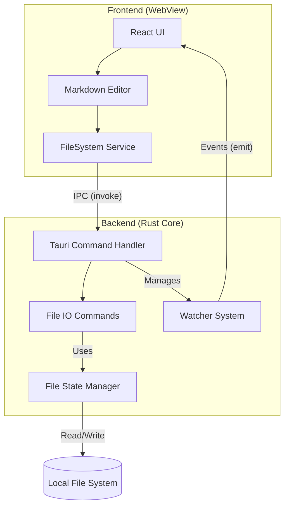
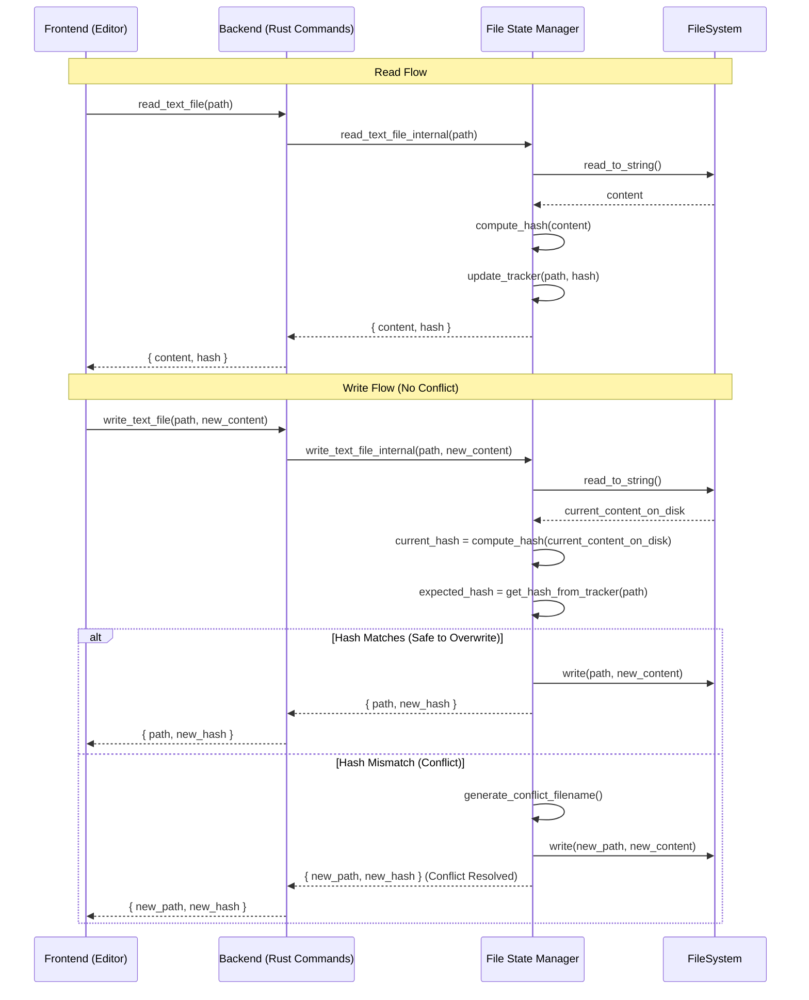
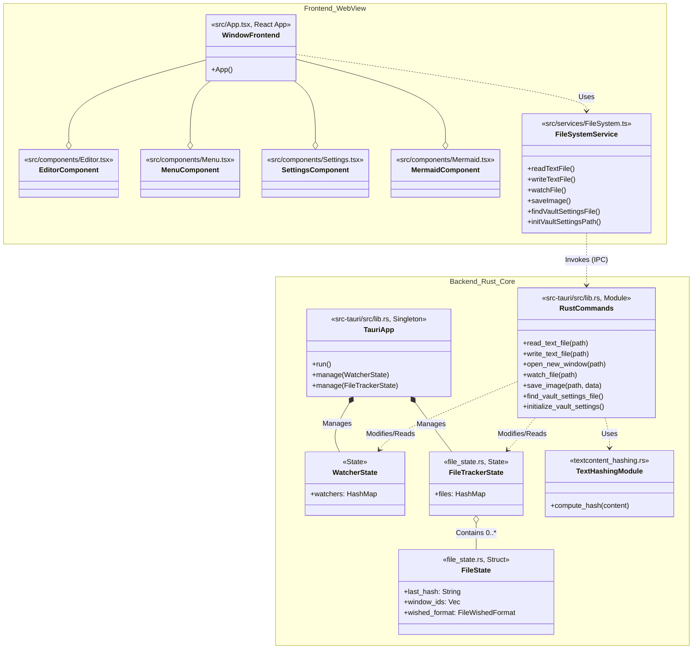
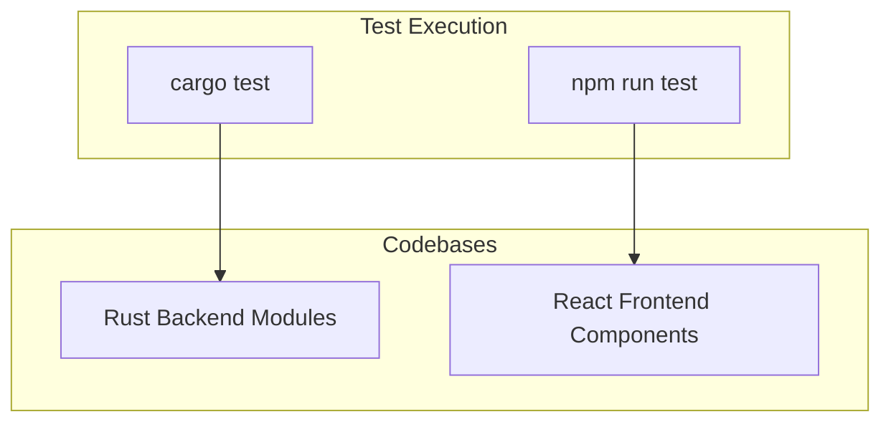
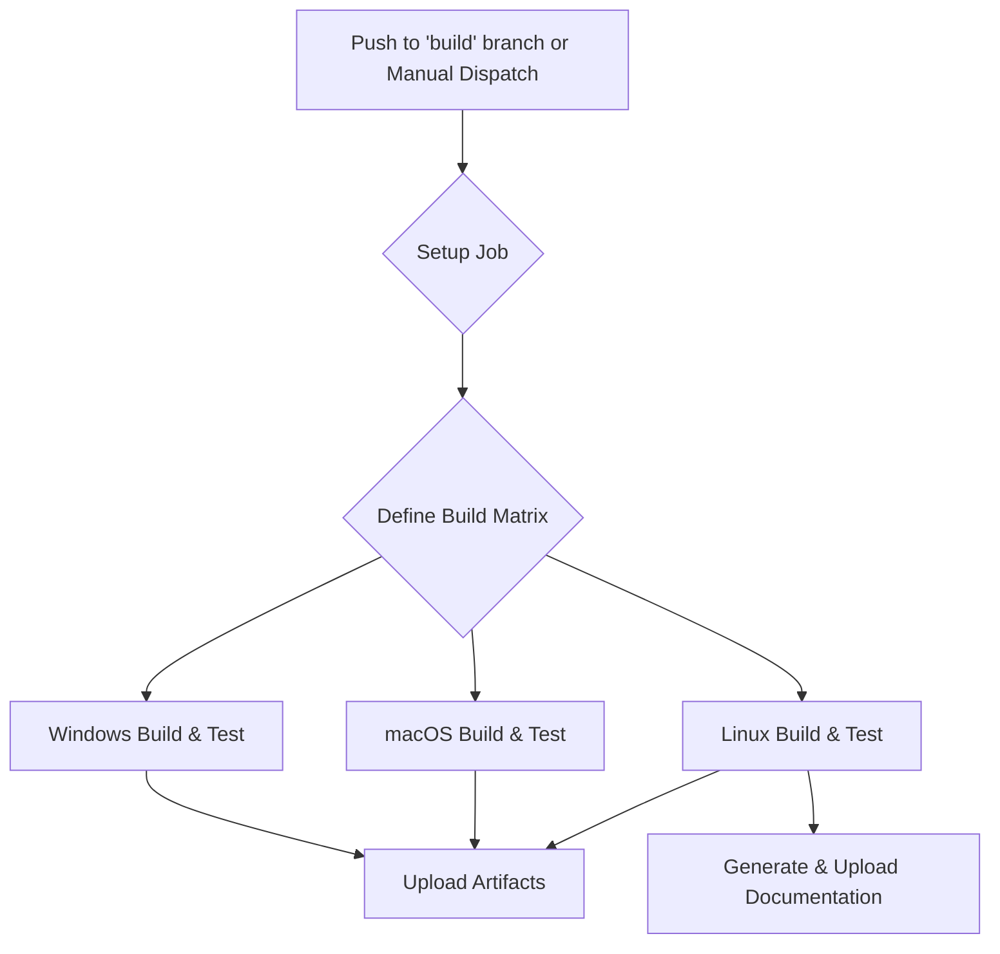

# Lattice Architecture (v2)

Lattice is a local-first Markdown editor built with **Tauri**, combining a **Rust** backend for system interactions and performance with a **React (TypeScript)** frontend for the user interface. This document reflects the current architecture, including the introduction of a more robust file tracking system, new UI components, and a formal testing and CI pipeline.

## Technology Stack

- **Frontend**: React, TypeScript, Vite, CodeMirror, Vitest
- **Backend**: Rust, Tauri, `notify` (file watching)
- **Data Persistence**: Local file system (Markdown files).
- **Concurrency Control**: Hash-based optimistic locking (SHA-512) managed by the `FileState` module.

## High-Level Architecture

The application remains split into the Rust Core process and the Frontend WebView process. Communication is handled via Tauri's IPC bridge. The backend now contains a dedicated `FileState` manager to handle concurrency and file tracking.



## Key Components & Diagrams

### 1. File Operation & Concurrency

The concurrency model remains optimistic-locking but is now encapsulated within the `file_state.rs` module on the backend. The `FileTrackerState` holds a map of all known files, their last-seen hashes, and which windows are viewing them.



### 2. Class and Instance Diagram (UML)

This diagram is updated to include new UI components (`Menu`, `Settings`, `Mermaid`) and the new backend modules (`FileTrackerState`, `FileState`, `TextHashingModule`).



## Theme Design

Lattice uses an **orthogonal, two-theme model**: the editor (app) theme and the preview pane theme are fully independent of each other and of the OS color scheme.

### Editor Theme

Controlled by the `m_theme` state (`'dark' | 'light'`) in `App.tsx`, loaded from vault settings on startup and toggled via the toolbar. It is applied by setting `data-theme` on the root `.container` div, which cascades to all editor UI elements (toolbar, CodeMirror, dividers, etc.) via CSS attribute selectors.

### Preview Theme

Controlled by a separate `m_previewTheme` state (`'dark' | 'light'`) in `App.tsx`, defaulting to `'light'`. It is applied via:

- `data-preview-theme` on the `.preview-pane` div — drives background/text colors.
- `data-theme` on the inner `.markdown-body` div — drives `github-markdown-css` rendering.
- An explicit `color-scheme` CSS declaration on each `[data-preview-theme]` variant — this prevents the OS or root `color-scheme: light dark` from overriding the pane's rendering.

### Independence Guarantee

The two themes do not influence each other. A dark editor with a light preview, or any other combination, is valid. This is enforced at the CSS level: `.preview-pane[data-preview-theme]` rules carry their own `color-scheme` declaration, isolating the pane from both the ancestor `data-theme` cascade and the OS preference.

```
OS color scheme
      │  (blocked by color-scheme declaration on .preview-pane)
      ▼
.container [data-theme]          ← Editor / App theme
      │
      ├── toolbar, dividers, CodeMirror ...
      │
      └── .preview-pane [data-preview-theme]   ← Preview theme (independent)
                │
                └── .markdown-body [data-theme=previewTheme]
```

### Adding a New Theme Variant

To add a new preview theme (e.g. `'sepia'`):
1. Extend the `ViewMode`-style union type for `m_previewTheme` in `App.tsx`.
2. Add a `.preview-pane[data-preview-theme="sepia"] { color-scheme: light; ... }` block in `App.css`.
3. Add the matching `.markdown-body[data-theme="sepia"]` overrides in `App.css`.

No changes to `App.tsx` rendering logic are needed beyond wiring `setPreviewTheme` to a UI control.

## Testing Architecture

The project employs a dual strategy for testing, covering both the Rust backend and the React frontend.

-   **Backend (Rust)**: Unit and integration tests are written within the Rust modules (e.g., `lib.rs`, `file_state.rs`) under a `#[cfg(test)]` configuration. They are executed with `cargo test`.
-   **Frontend (React)**: Component and hook tests are written using **Vitest**, a Vite-native test framework. It uses `jsdom` to simulate a browser environment, allowing tests to run in a standard Node.js environment.



## Continuous Integration (CI) Architecture

The CI pipeline is defined in `.github/workflows/buildAndTest.yml` and is triggered on pushes to specific branches or manually. It uses a matrix strategy to ensure the application builds and passes tests across all major desktop platforms.

### CI Pipeline Flow



### Key CI Steps:
1.  **Setup Job**: A preliminary job determines which platforms (e.g., `windows-desktop`, `linux-desktop`, `all`) to run on based on the manual trigger input or the branch name. It generates a JSON matrix for the next job.
2.  **Build & Test Job**: This job runs in parallel for each configuration in the matrix.
    -   **Environment**: Sets up Node.js, Rust (including cross-compilation targets if needed), and caches dependencies.
    -   **Build**: Compiles the Rust backend and builds the frontend, finally bundling them into a native application (`.exe`, `.dmg`, `.AppImage`).
    -   **Test**: Runs `cargo test` for the backend and `npm run test` (Vitest) for the frontend to ensure correctness.
    -   **Artifacts**: The final compiled applications and documentation are uploaded as artifacts for download and deployment.
