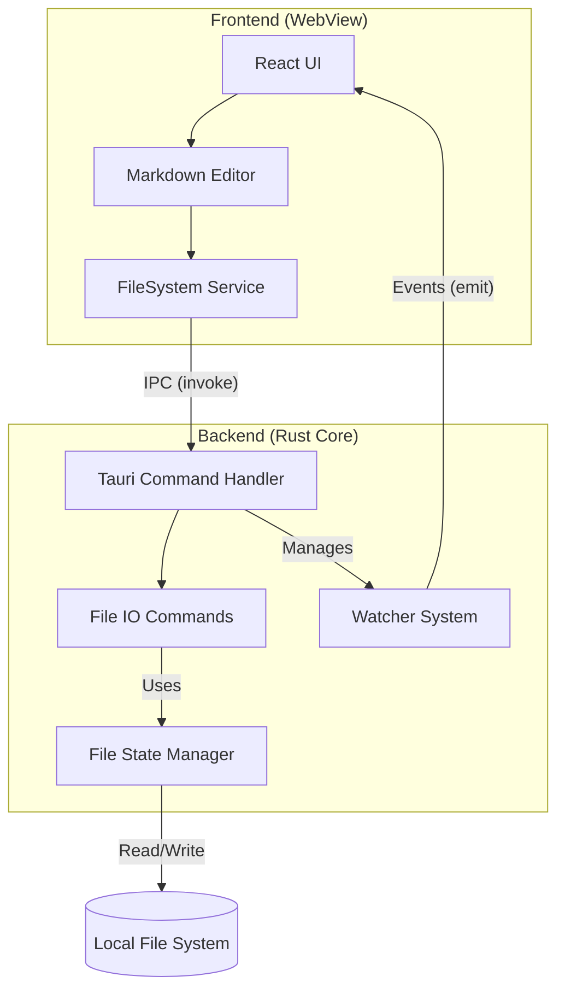
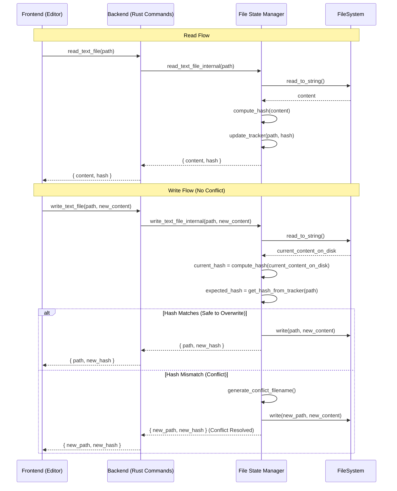
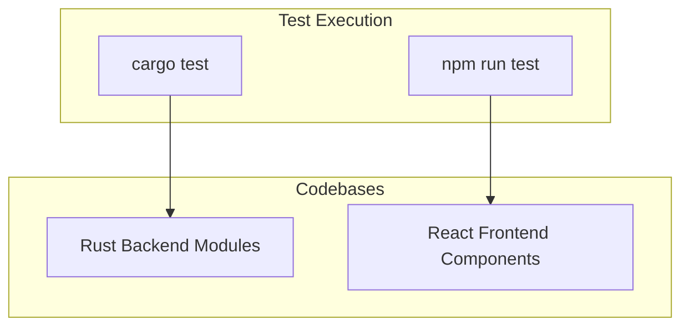
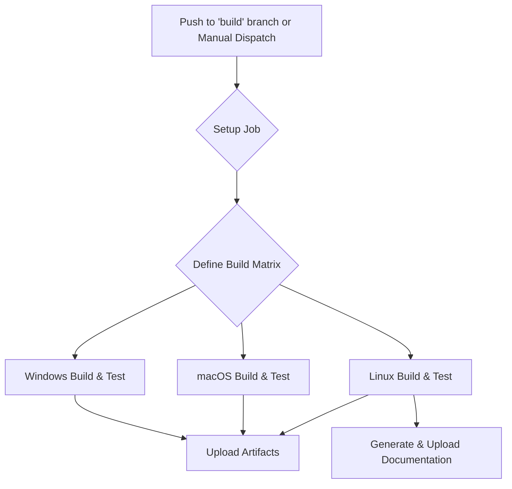
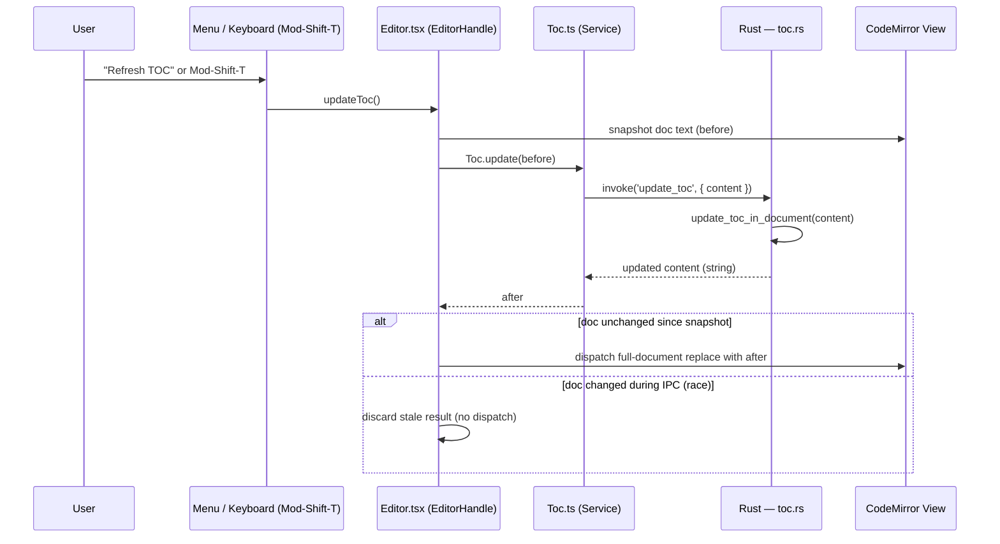
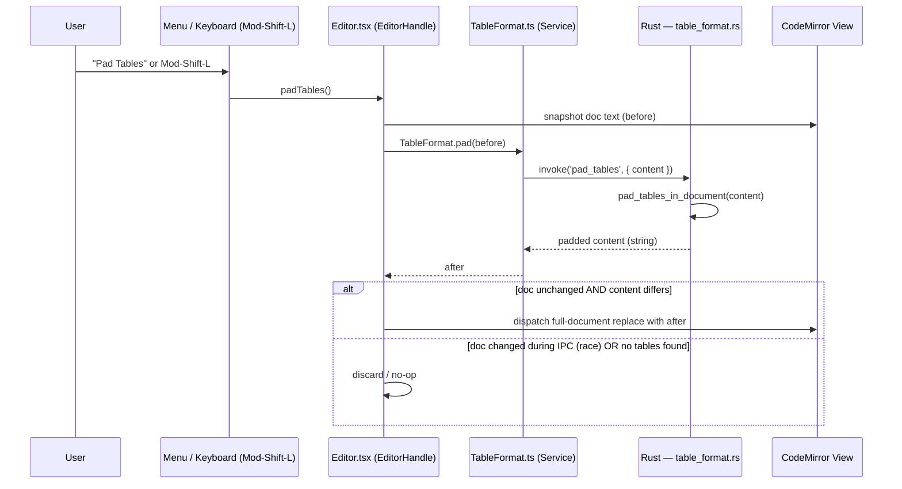

# Lattice Architecture (v2)

Lattice is a local-first Markdown editor built with **Tauri**, combining a **Rust** backend for system interactions and performance with a **React (TypeScript)** frontend for the user interface. This document reflects the current architecture, including the introduction of a more robust file tracking system, new UI components, and a formal testing and CI pipeline.

## Table of Content (Structure of document)
<!-- TOC -->
- [Table of Content (Structure of document)](#table-of-content-structure-of-document)
- [Technology Stack](#technology-stack)
- [High-Level Architecture](#high-level-architecture)
- [Key Components & Diagrams](#key-components-diagrams)
  - [1. File Operation & Concurrency](#1-file-operation-concurrency)
  - [2. Class and Instance Diagram (UML)](#2-class-and-instance-diagram-uml)
- [Theme Design](#theme-design)
  - [Editor Theme](#editor-theme)
  - [Preview Theme](#preview-theme)
  - [Independence Guarantee](#independence-guarantee)
  - [Adding a New Theme Variant](#adding-a-new-theme-variant)
- [Testing Architecture](#testing-architecture)
- [Continuous Integration (CI) Architecture](#continuous-integration-ci-architecture)
  - [CI Pipeline Flow](#ci-pipeline-flow)
  - [Key CI Steps:](#key-ci-steps)
- [Feature: Table of Contents (TOC)](#feature-table-of-contents-toc)
  - [Overview](#overview)
  - [Rust Backend — `toc.rs`](#rust-backend--tocrs)
  - [Frontend Glue](#frontend-glue)
  - [TOC Flow Diagram](#toc-flow-diagram)
- [Feature: Table Padding](#feature-table-padding)
  - [Overview](#overview-1)
  - [Rust Backend — `table_format.rs`](#rust-backend--table_formatrs)
  - [Frontend Glue](#frontend-glue-1)
  - [Table Padding Flow Diagram](#table-padding-flow-diagram)
<!-- /TOC -->

## Technology Stack

- **Frontend**: React, TypeScript, Vite, CodeMirror, Vitest
- **Backend**: Rust, Tauri, `notify` (file watching)
- **Data Persistence**: Local file system (Markdown files).
- **Concurrency Control**: Hash-based optimistic locking (SHA-512) managed by the `FileState` module.

## High-Level Architecture

The application remains split into the Rust Core process and the Frontend WebView process. Communication is handled via Tauri's IPC bridge. The backend now contains a dedicated `FileState` manager to handle concurrency and file tracking.



## Key Components & Diagrams

### 1. File Operation & Concurrency

The concurrency model remains optimistic-locking but is now encapsulated within the `file_state.rs` module on the backend. The `FileTrackerState` holds a map of all known files, their last-seen hashes, and which windows are viewing them.



### 2. Class and Instance Diagram (UML)

This diagram is updated to include new UI components (`Menu`, `Settings`, `Mermaid`) and the new backend modules (`FileTrackerState`, `FileState`, `TextHashingModule`).


## Theme Design

Lattice uses an **orthogonal, two-theme model**: the editor (app) theme and the preview pane theme are fully independent of each other and of the OS color scheme.

### Editor Theme

Controlled by the `m_theme` state (`'dark' | 'light'`) in `App.tsx`, loaded from vault settings on startup and toggled via the toolbar. It is applied by setting `data-theme` on the root `.container` div, which cascades to all editor UI elements (toolbar, CodeMirror, dividers, etc.) via CSS attribute selectors.

### Preview Theme

Controlled by a separate `m_previewTheme` state (`'dark' | 'light'`) in `App.tsx`, defaulting to `'light'`. It is applied via:

- `data-preview-theme` on the `.preview-pane` div — drives background/text colors.
- `data-theme` on the inner `.markdown-body` div — drives `github-markdown-css` rendering.
- An explicit `color-scheme` CSS declaration on each `[data-preview-theme]` variant — this prevents the OS or root `color-scheme: light dark` from overriding the pane's rendering.

### Independence Guarantee

The two themes do not influence each other. A dark editor with a light preview, or any other combination, is valid. This is enforced at the CSS level: `.preview-pane[data-preview-theme]` rules carry their own `color-scheme` declaration, isolating the pane from both the ancestor `data-theme` cascade and the OS preference.

```
OS color scheme
      │  (blocked by color-scheme declaration on .preview-pane)
      ▼
.container [data-theme]          ← Editor / App theme
      │
      ├── toolbar, dividers, CodeMirror ...
      │
      └── .preview-pane [data-preview-theme]   ← Preview theme (independent)
                │
                └── .markdown-body [data-theme=previewTheme]
```

### Adding a New Theme Variant

To add a new preview theme (e.g. `'sepia'`):
1. Extend the `ViewMode`-style union type for `m_previewTheme` in `App.tsx`.
2. Add a `.preview-pane[data-preview-theme="sepia"] { color-scheme: light; ... }` block in `App.css`.
3. Add the matching `.markdown-body[data-theme="sepia"]` overrides in `App.css`.

No changes to `App.tsx` rendering logic are needed beyond wiring `setPreviewTheme` to a UI control.

## Testing Architecture

The project employs a dual strategy for testing, covering both the Rust backend and the React frontend.

-   **Backend (Rust)**: Unit and integration tests are written within the Rust modules (e.g., `lib.rs`, `file_state.rs`) under a `#[cfg(test)]` configuration. They are executed with `cargo test`.
-   **Frontend (React)**: Component and hook tests are written using **Vitest**, a Vite-native test framework. It uses `jsdom` to simulate a browser environment, allowing tests to run in a standard Node.js environment.



## Continuous Integration (CI) Architecture

The CI pipeline is defined in `.github/workflows/buildAndTest.yml` and is triggered on pushes to specific branches or manually. It uses a matrix strategy to ensure the application builds and passes tests across all major desktop platforms.

### CI Pipeline Flow



### Key CI Steps:
1.  **Setup Job**: A preliminary job determines which platforms (e.g., `windows-desktop`, `linux-desktop`, `all`) to run on based on the manual trigger input or the branch name. It generates a JSON matrix for the next job.
2.  **Build & Test Job**: This job runs in parallel for each configuration in the matrix.
    -   **Environment**: Sets up Node.js, Rust (including cross-compilation targets if needed), and caches dependencies.
    -   **Build**: Compiles the Rust backend and builds the frontend, finally bundling them into a native application (`.exe`, `.dmg`, `.AppImage`).
    -   **Test**: Runs `cargo test` for the backend and `npm run test` (Vitest) for the frontend to ensure correctness.
    -   **Artifacts**: The final compiled applications and documentation are uploaded as artifacts for download and deployment.

---

## Feature: Table of Contents (TOC)

### Overview

The TOC feature lets a user insert a `<!-- TOC -->` / `<!-- /TOC -->` marker pair anywhere in the document and have Lattice auto-generate (and later regenerate) a linked heading list inside it. The feature follows the same architectural pattern as all pure-logic features: **all parsing and rewriting logic lives in Rust**; the frontend is a thin glue layer that hands text to the backend and dispatches the result back into CodeMirror.

### Rust Backend — `toc.rs`

The module exposes one public entry-point:

```
update_toc_in_document(content: &str) -> String
```

It performs a single-pass scan of the document and replaces the body of every `<!-- TOC … -->` / `<!-- /TOC -->` block with a freshly generated bulleted list of headings. Key properties:

- **Marker parsing**: The opening marker accepts optional `minLevel=N` and `maxLevel=N` key-value options (defaults: H2–H6). Unknown options are silently ignored for forward compatibility.
- **Heading collection**: Headings are gathered only from text that lies outside fenced code blocks (` ``` ` / `~~~`). Headings that themselves sit inside the TOC body are skipped, so the generated list never references its own entries.
- **Slug generation**: Each heading is converted to a GitHub-style anchor slug (lowercase, non-alphanumerics stripped, spaces to hyphens). Duplicate headings are disambiguated with `-1`, `-2`, … suffixes.
- **Idempotency**: Running the command on an already up-to-date document produces a string-equal result — the caller can rely on this to avoid spurious CodeMirror dispatches.
- **Newline preservation**: CRLF line endings in the original document are preserved in the output.

The Tauri command `update_toc` is a thin wrapper that calls `update_toc_in_document` and returns the result string.

### Frontend Glue

| Layer | File | Responsibility |
|---|---|---|
| Service | `src/services/Toc.ts` | Wraps `invoke('update_toc', { content })`. Also exports `TOC_OPEN_MARKER` / `TOC_CLOSE_MARKER` constants so other layers don't duplicate the literal strings. |
| CodeMirror extension | `src/editor-extensions/toc-tooltip.ts` | A `StateField` + `showTooltip` that re-evaluates on every cursor move. If the cursor's line is between a TOC open marker and its matching close marker, a tooltip reading *"Press Ctrl/Cmd+Shift+T to refresh TOC"* is shown. Detection is intentionally done on the frontend (not via IPC) to keep the tooltip latency imperceptible. |
| Editor handle | `src/components/Editor.tsx` | Exposes `updateToc()` and `insertTocBlock()` on the imperative `EditorHandle`. Both call `refreshTocFromBackend()`, which snapshots the document, calls `Toc.update`, then guards the dispatch: if the document changed during the IPC round-trip, the stale result is discarded instead of clobbering the user's edits. `Mod-Shift-T` is bound to the refresh command. |
| Menu | `src/App.tsx` | "Insert TOC" triggers `insertTocBlock()` (inserts the marker pair then immediately refreshes). "Refresh TOC" triggers `updateToc()`. |

### TOC Flow Diagram



---

## Feature: Table Padding

### Overview

The Table Padding feature reformats any GFM pipe table in the document so that every column is space-padded to the width of its widest cell, making tables easier to read in raw Markdown. Like TOC, all detection and rewriting logic is **pure Rust**; the frontend layer is a minimal IPC wrapper.

### Rust Backend — `table_format.rs`

The module exposes one public entry-point:

```
pad_tables_in_document(content: &str) -> String
```

It performs a linear scan looking for table candidates and rewrites each one in place. Key properties:

- **Table detection**: A table candidate is a run of consecutive non-blank lines where (1) the first line contains at least one `|`, (2) the second line is a GFM alignment-separator row (each cell matches `:?-+:?`), and (3) all subsequent lines in the run also contain at least one `|`. Lines inside fenced code blocks are unconditionally skipped.
- **Column alignment**: The `Alignment` enum captures four states — `Default` (no marker), `Left` (`:---`), `Right` (`---:`), and `Center` (`:---:`). Cell content is padded on the appropriate side; the separator row is regenerated with the correct number of `-` characters (minimum 3) and `:` markers.
- **Row normalisation**: Rows with fewer cells than the widest row are right-extended with empty cells. Rows with extra cells keep their extra cells.
- **Output shape**: Every rewritten row uses the canonical `| cell | cell |` form — leading and trailing pipes are always present, cells are surrounded by a single space.
- **Width measurement**: Column width is measured in Unicode scalar value count (`char`), not bytes — a practical approximation for typical Markdown content without pulling in a `unicode-width` dependency.
- **Idempotency**: Tables that are already in canonical padded form are emitted unchanged; the caller can detect a no-op by comparing the returned string to the input.

The Tauri command `pad_tables` is a thin wrapper that calls `pad_tables_in_document` and returns the result string.

### Frontend Glue

| Layer | File | Responsibility |
|---|---|---|
| Service | `src/services/TableFormat.ts` | Wraps `invoke('pad_tables', { content })`. Mirrors the shape of `Toc.ts` so both document-rewriting operations are interchangeable at call sites. |
| Editor handle | `src/components/Editor.tsx` | Exposes `padTables()` on `EditorHandle`. Internally `padTablesFromBackend()` uses the same snapshot → IPC → guarded-dispatch pattern as the TOC refresh: if the document changed during the round-trip the stale result is discarded. `Mod-Shift-L` is bound to the command. |
| Menu | `src/components/Menu.tsx` + `src/App.tsx` | A "Pad Tables" menu item calls `padTables()` on the editor handle. |

### Table Padding Flow Diagram


